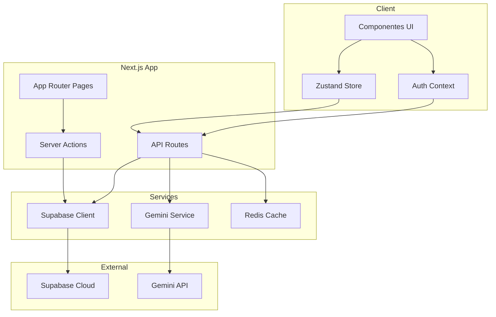
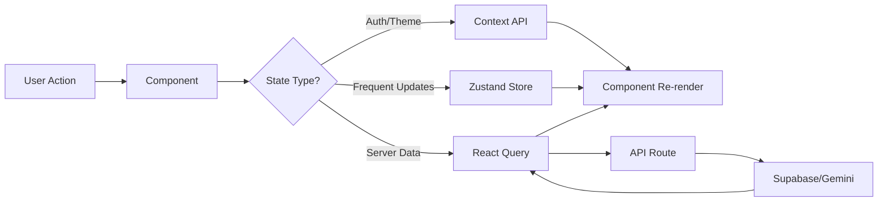
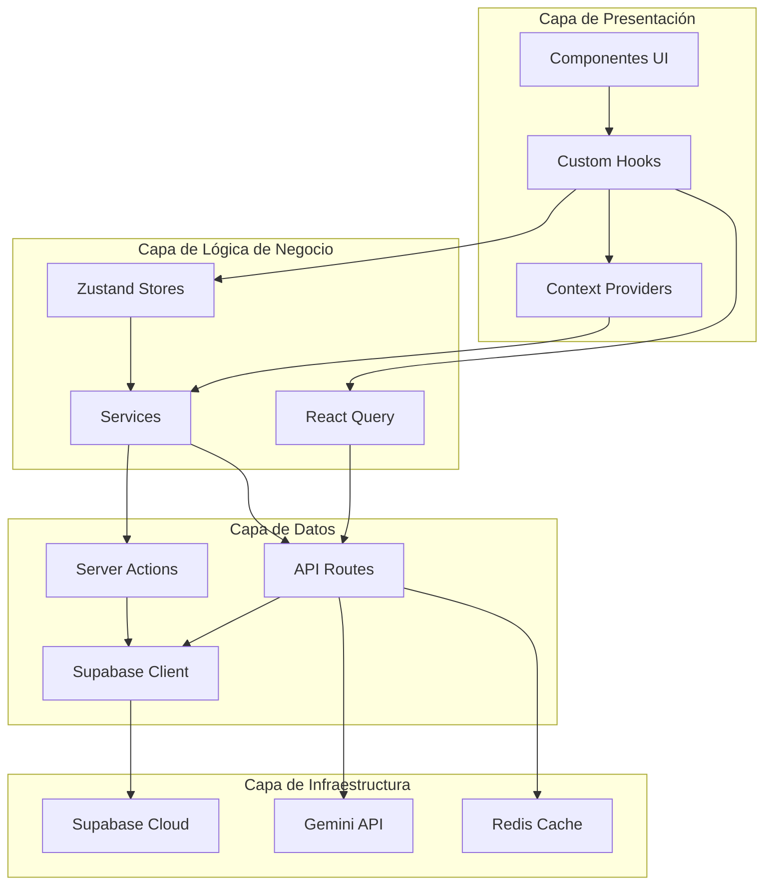
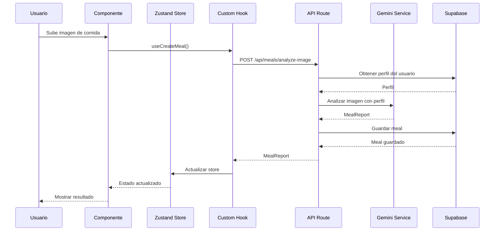

# Arquitectura del Proyecto Qalia Next.js

## 📋 Índice

1. [Visión General](#visión-general)
2. [Stack Tecnológico](#stack-tecnológico)
3. [Arquitectura General](#arquitectura-general)
4. [Estructura de Directorios](#estructura-de-directorios)
5. [Gestión de Estado](#gestión-de-estado)
6. [Arquitectura de Seguridad](#arquitectura-de-seguridad)
7. [Sistema de Tipos TypeScript](#sistema-de-tipos-typescript)
8. [Sistema de Analytics y Gráficos](#sistema-de-analytics-y-gráficos)
9. [Sistema de Chat e Historial](#sistema-de-chat-e-historial)
10. [Sistema de Comunidad (Futuro)](#sistema-de-comunidad-futuro)
11. [Arquitectura de API Routes](#arquitectura-de-api-routes)
12. [Sistema de Componentes UI](#sistema-de-componentes-ui)
13. [Configuración PWA](#configuración-pwa)
14. [Testing y Calidad de Código](#testing-y-calidad-de-código)
15. [Flujo de Datos](#flujo-de-datos)
16. [Guías de Desarrollo](#guías-de-desarrollo)

---

## 🎯 Visión General

El proyecto Qalia Next.js es una aplicación de nutrición con IA que proporciona análisis de alimentos, seguimiento de comidas, y un coach nutricional personalizado. La arquitectura está diseñada para ser:

- **Segura:** API keys y prompts protegidos en el servidor
- **Escalable:** Estructura modular y separación de responsabilidades
- **Colaborativa:** Código bien organizado para 3 desarrolladores
- **Type-safe:** TypeScript estricto en todo el proyecto
- **Performance-first:** Optimizaciones de Next.js y caching inteligente
- **PWA-ready:** Instalable en iOS y Android

---

## 🛠 Stack Tecnológico

### Core
- **Framework:** Next.js 16.1.6 (App Router)
- **Lenguaje:** TypeScript 5.x (strict mode)
- **Runtime:** React 19.2.3
- **Estilos:** Tailwind CSS 4

### Backend & Database
- **BaaS:** Supabase (Auth, Database, Storage)
- **ORM:** Prisma (type-safe database access)
- **AI:** Google Gemini 2.0 Flash (server-side only)

### Estado & Datos
- **Estado Global:** Zustand (lightweight state management)
- **Context API:** Para autenticación y tema
- **React Query:** Para caching y sincronización de datos

### UI & UX
- **Componentes:** shadcn/ui (customizable, accessible)
- **Formularios:** React Hook Form + Zod validation
- **Animaciones:** Framer Motion
- **Iconos:** Lucide React
- **Gráficos:** Recharts (para analytics y visualización de datos)
- **Internacionalización:** next-intl (soporte multi-idioma)

### Testing & Calidad
- **Testing:** Vitest + React Testing Library
- **Linting:** ESLint + TypeScript ESLint
- **Formatting:** Prettier
- **Type Checking:** TypeScript strict mode

### DevOps & Deploy
- **Hosting:** Vercel (recomendado para Next.js)
- **CI/CD:** GitHub Actions
- **Environment:** Variables de entorno seguras

---

## 🏗 Arquitectura General

### Diagrama de Arquitectura



### Principios de Diseño

1. **Separación de Responsabilidades:** Cada capa tiene una función clara
2. **Defensa en Profundidad:** Múltiples capas de seguridad
3. **Single Source of Truth:** Estado centralizado y sincronizado
4. **Type Safety:** TypeScript en todo el stack
5. **Performance:** Optimizaciones en cada capa
6. **Developer Experience:** Código limpio y bien documentado

---

## 📁 Estructura de Directorios

```
qalia-nextjs-app/
├── app/                          # Next.js App Router
│   ├── (auth)/                   # Grupo de rutas de autenticación
│   │   ├── login/
│   │   ├── register/
│   │   └── layout.tsx
│   ├── (dashboard)/              # Grupo de rutas protegidas
│   │   ├── dashboard/
│   │   │   ├── page.tsx         # Dashboard con gráficos
│   │   │   └── components/       # Componentes específicos del dashboard
│   │   ├── meals/
│   │   ├── recipes/
│   │   ├── profile/
│   │   ├── chat/                 # Rutas de chat
│   │   │   ├── page.tsx
│   │   │   └── [sessionId]/
│   │   │       └── page.tsx
│   │   ├── community/             # Rutas de comunidad (futuro)
│   │   │   ├── page.tsx
│   │   │   ├── groups/
│   │   │   └── [groupId]/
│   │   └── layout.tsx
│   ├── api/                      # API Routes
│   │   ├── auth/
│   │   ├── profile/
│   │   ├── meals/
│   │   ├── gemini/
│   │   ├── analytics/             # API routes para gráficos
│   │   │   ├── weight/
│   │   │   │   ├── route.ts
│   │   │   │   └── [id]/route.ts
│   │   │   └── calories/
│   │   │       └── route.ts
│   │   ├── chat/                 # API routes para chat
│   │   │   ├── sessions/
│   │   │   │   └── route.ts
│   │   │   └── [sessionId]/
│   │   │       └── messages/route.ts
│   │   └── community/            # API routes para comunidad
│   │       ├── groups/
│   │       │   ├── route.ts
│   │       │   └── [groupId]/
│   │       │       ├── route.ts
│   │       │       ├── members/route.ts
│   │       │       └── stats/route.ts
│   │       └── activity/route.ts
│   ├── actions/                  # Server Actions
│   │   ├── auth.ts
│   │   ├── meals.ts
│   │   ├── profile.ts
│   │   ├── analytics.ts
│   │   └── chat.ts
│   ├── layout.tsx                # Root layout
│   ├── page.tsx                  # Home page
│   ├── globals.css               # Estilos globales
│   └── manifest.json              # PWA manifest
│
├── components/                   # Componentes React
│   ├── ui/                       # Componentes base (shadcn/ui)
│   │   ├── button.tsx
│   │   ├── card.tsx
│   │   ├── input.tsx
│   │   └── ...
│   ├── features/                 # Componentes por funcionalidad
│   │   ├── auth/
│   │   │   ├── LoginForm.tsx
│   │   │   └── RegisterForm.tsx
│   │   ├── meals/
│   │   │   ├── MealCard.tsx
│   │   │   ├── MealForm.tsx
│   │   │   └── ImageUploader.tsx
│   │   ├── chat/
│   │   │   ├── ChatInterface.tsx
│   │   │   ├── MessageBubble.tsx
│   │   │   └── ChatSessionList.tsx
│   │   ├── analytics/             # Componentes de gráficos
│   │   │   ├── WeightChart.tsx
│   │   │   ├── CalorieChart.tsx
│   │   │   ├── WeightEntryForm.tsx
│   │   │   └── AnalyticsSummary.tsx
│   │   ├── community/             # Componentes de comunidad
│   │   │   ├── GroupCard.tsx
│   │   │   ├── GroupList.tsx
│   │   │   ├── CreateGroupDialog.tsx
│   │   │   ├── SharedStatsFeed.tsx
│   │   │   └── GroupActivityFeed.tsx
│   │   └── profile/
│   │       ├── ProfileForm.tsx
│   │       └── BMICalculator.tsx
│   ├── layout/                   # Componentes de layout
│   │   ├── Header.tsx
│   │   ├── Sidebar.tsx
│   │   ├── Footer.tsx
│   │   └── MobileNav.tsx
│   └── providers/                # Context providers
│       ├── AuthProvider.tsx
│       ├── ThemeProvider.tsx
│       └── QueryProvider.tsx
│
├── lib/                         # Utilidades y configuraciones
│   ├── supabase/                # Supabase client y config
│   │   ├── client.ts
│   │   ├── server.ts
│   │   └── admin.ts
│   ├── gemini/                  # Gemini service (server-side)
│   │   ├── client.ts
│   │   ├── prompts.ts
│   │   └── validators.ts
│   ├── db/                      # Database utilities
│   │   ├── queries.ts
│   │   └── mutations.ts
│   ├── utils/                   # Utilidades generales
│   │   ├── cn.ts                # Class names utility
│   │   ├── date.ts              # Date utilities
│   │   └── validation.ts        # Validation helpers
│   └── constants.ts             # Constantes de la app
│
├── stores/                      # Zustand stores
│   ├── authStore.ts
│   ├── profileStore.ts
│   ├── mealsStore.ts
│   ├── chatStore.ts
│   ├── analyticsStore.ts
│   └── communityStore.ts
│
├── types/                       # Tipos TypeScript
│   ├── index.ts                 # Tipos exportados
│   ├── auth.ts
│   ├── profile.ts
│   ├── meals.ts
│   ├── gemini.ts
│   ├── api.ts
│   ├── analytics.ts              # Tipos para gráficos
│   ├── chat.ts                  # Tipos para chat
│   └── community.ts             # Tipos para comunidad
│
├── hooks/                       # Custom React hooks
│   ├── useAuth.ts
│   ├── useProfile.ts
│   ├── useMeals.ts
│   ├── useChat.ts
│   ├── useAnalytics.ts           # Hooks para gráficos
│   ├── useCommunity.ts          # Hooks para comunidad
│   └── useMediaQuery.ts
│
├── services/                    # Servicios de negocio
│   ├── authService.ts
│   ├── profileService.ts
│   ├── mealService.ts
│   ├── geminiService.ts
│   ├── notificationService.ts
│   ├── analyticsService.ts       # Servicio para gráficos
│   ├── chatService.ts           # Servicio para chat
│   └── communityService.ts      # Servicio para comunidad
│
├── prisma/                      # Prisma ORM
│   ├── schema.prisma
│   ├── migrations/
│   └── seed.ts
│
├── public/                      # Archivos estáticos
│   ├── icons/
│   ├── images/
│   └── sw.js                    # Service Worker
│
├── tests/                       # Tests
│   ├── unit/
│   ├── integration/
│   └── e2e/
│
├── docs/                        # Documentación
│   ├── architecture.md
│   ├── api.md
│   └── contributing.md
│
├── .env.local                   # Variables de entorno (local)
├── .env.example                 # Template de variables
├── next.config.ts               # Configuración Next.js
├── tailwind.config.ts           # Configuración Tailwind
├── tsconfig.json                # Configuración TypeScript
├── package.json
└── README.md
```

---

## 🔄 Gestión de Estado

### Estrategia Híbrida

Usamos una combinación de **Zustand** y **Context API** para optimizar el rendimiento y la experiencia de desarrollo:

#### Zustand (Estado Global Ligero)

Para estado que cambia frecuentemente y necesita ser compartido entre componentes:

```typescript
// stores/profileStore.ts
import { create } from 'zustand';
import { persist } from 'zustand/middleware';
import type { UserProfile } from '@/types';

interface ProfileState {
  profile: UserProfile | null;
  isLoading: boolean;
  error: string | null;
  
  // Actions
  fetchProfile: (userId: string) => Promise<void>;
  updateProfile: (updates: Partial<UserProfile>) => Promise<void>;
  clearProfile: () => void;
}

export const useProfileStore = create<ProfileState>()(
  persist(
    (set, get) => ({
      profile: null,
      isLoading: false,
      error: null,
      
      fetchProfile: async (userId: string) => {
        set({ isLoading: true, error: null });
        try {
          const profile = await profileService.getProfile(userId);
          set({ profile, isLoading: false });
        } catch (error) {
          set({ error: 'Error fetching profile', isLoading: false });
        }
      },
      
      updateProfile: async (updates: Partial<UserProfile>) => {
        const { profile } = get();
        if (!profile) return;
        
        set({ isLoading: true });
        try {
          const updated = await profileService.updateProfile(profile.id, updates);
          set({ profile: updated, isLoading: false });
        } catch (error) {
          set({ error: 'Error updating profile', isLoading: false });
        }
      },
      
      clearProfile: () => set({ profile: null, error: null }),
    }),
    {
      name: 'profile-storage',
      partialize: (state) => ({ profile: state.profile }),
    }
  )
);
```

#### Context API (Autenticación y Tema)

Para estado que afecta a toda la aplicación y necesita ser accesible desde cualquier lugar:

```typescript
// components/providers/AuthProvider.tsx
'use client';

import { createContext, useContext, useEffect, useState } from 'react';
import type { User, Session } from '@supabase/supabase-js';
import { supabase } from '@/lib/supabase/client';
import type { AuthContextType } from '@/types';

const AuthContext = createContext<AuthContextType | undefined>(undefined);

export function AuthProvider({ children }: { children: React.ReactNode }) {
  const [user, setUser] = useState<User | null>(null);
  const [session, setSession] = useState<Session | null>(null);
  const [loading, setLoading] = useState(true);

  useEffect(() => {
    // Get initial session
    supabase.auth.getSession().then(({ data: { session } }) => {
      setSession(session);
      setUser(session?.user ?? null);
      setLoading(false);
    });

    // Listen for auth changes
    const {
      data: { subscription },
    } = supabase.auth.onAuthStateChange((_event, session) => {
      setSession(session);
      setUser(session?.user ?? null);
    });

    return () => subscription.unsubscribe();
  }, []);

  const value: AuthContextType = {
    user,
    session,
    loading,
    signIn: async (email: string, password: string) => {
      const { error } = await supabase.auth.signInWithPassword({
        email,
        password,
      });
      if (error) throw error;
    },
    signUp: async (email: string, password: string, name: string) => {
      const { error } = await supabase.auth.signUp({
        email,
        password,
        options: {
          data: { name },
        },
      });
      if (error) throw error;
    },
    signOut: async () => {
      await supabase.auth.signOut();
    },
  };

  return <AuthContext.Provider value={value}>{children}</AuthContext.Provider>;
}

export function useAuth() {
  const context = useContext(AuthContext);
  if (context === undefined) {
    throw new Error('useAuth must be used within an AuthProvider');
  }
  return context;
}
```

#### React Query (Caching y Sincronización)

Para datos del servidor que necesitan caching, revalidación y sincronización:

```typescript
// hooks/useMeals.ts
import { useQuery, useMutation, useQueryClient } from '@tanstack/react-query';
import { mealService } from '@/services/mealService';
import type { MealReport } from '@/types';

export function useMeals(userId: string) {
  return useQuery({
    queryKey: ['meals', userId],
    queryFn: () => mealService.getMeals(userId),
    staleTime: 5 * 60 * 1000, // 5 minutos
    gcTime: 10 * 60 * 1000, // 10 minutos
  });
}

export function useCreateMeal() {
  const queryClient = useQueryClient();
  
  return useMutation({
    mutationFn: mealService.createMeal,
    onSuccess: () => {
      queryClient.invalidateQueries({ queryKey: ['meals'] });
    },
  });
}
```

### Flujo de Datos del Estado



---

## 🔒 Arquitectura de Seguridad

### Principios de Seguridad

1. **Zero Trust:** Nunca confiar en el cliente
2. **Defense in Depth:** Múltiples capas de seguridad
3. **Least Privilege:** Mínimos permisos necesarios
4. **Secure by Default:** Configuraciones seguras por defecto

### Capas de Seguridad

#### 1. Variables de Entorno

```bash
# .env.local (NO commit to git)
NEXT_PUBLIC_SUPABASE_URL=https://your-project.supabase.co
NEXT_PUBLIC_SUPABASE_ANON_KEY=your-anon-key

# Server-only variables (NEVER exposed to client)
GEMINI_API_KEY=your-gemini-api-key
SUPABASE_SERVICE_ROLE_KEY=your-service-role-key
DATABASE_URL=postgresql://...
```

#### 2. API Routes Seguras

```typescript
// app/api/gemini/analyze-image/route.ts
import { NextRequest, NextResponse } from 'next/server';
import { verifyAuth } from '@/lib/auth/middleware';
import { geminiService } from '@/lib/gemini/client';

export async function POST(request: NextRequest) {
  try {
    // 1. Verificar autenticación
    const user = await verifyAuth(request);
    if (!user) {
      return NextResponse.json({ error: 'Unauthorized' }, { status: 401 });
    }

    // 2. Validar input
    const body = await request.json();
    const { imageBase64 } = body;
    
    if (!imageBase64) {
      return NextResponse.json({ error: 'Missing image' }, { status: 400 });
    }

    // 3. Obtener perfil del usuario (server-side)
    const profile = await profileService.getProfile(user.id);
    
    // 4. Llamar a Gemini (server-side, API key protegida)
    const result = await geminiService.analyzeFoodImage(imageBase64, profile);
    
    // 5. Guardar resultado en base de datos
    await mealService.createMeal(user.id, result);
    
    return NextResponse.json(result);
  } catch (error) {
    console.error('Error analyzing image:', error);
    return NextResponse.json(
      { error: 'Internal server error' },
      { status: 500 }
    );
  }
}
```

#### 3. Middleware de Autenticación

```typescript
// middleware.ts
import { createMiddlewareClient } from '@supabase/auth-helpers-nextjs';
import { NextResponse } from 'next/server';
import type { NextRequest } from 'next/server';

export async function middleware(req: NextRequest) {
  const res = NextResponse.next();
  const supabase = createMiddlewareClient({ req, res });

  const {
    data: { session },
  } = await supabase.auth.getSession();

  // Proteger rutas del dashboard
  if (req.nextUrl.pathname.startsWith('/dashboard') && !session) {
    return NextResponse.redirect(new URL('/login', req.url));
  }

  // Redirigir si ya está autenticado
  if ((req.nextUrl.pathname === '/login' || req.nextUrl.pathname === '/register') && session) {
    return NextResponse.redirect(new URL('/dashboard', req.url));
  }

  return res;
}

export const config = {
  matcher: ['/dashboard/:path*', '/login', '/register'],
};
```

#### 4. Server Actions (Type-Safe)

```typescript
// app/actions/profile.ts
'use server';

import { revalidatePath } from 'next/cache';
import { auth } from '@/lib/supabase/server';
import { profileService } from '@/services/profileService';
import type { UpdateProfileInput } from '@/types';

export async function updateProfile(input: UpdateProfileInput) {
  // 1. Verificar autenticación
  const { data: { user } } = await auth.getUser();
  if (!user) {
    throw new Error('Unauthorized');
  }

  // 2. Validar input (Zod)
  const validated = updateProfileSchema.parse(input);
  
  // 3. Actualizar perfil
  await profileService.updateProfile(user.id, validated);
  
  // 4. Revalidar caché
  revalidatePath('/dashboard/profile');
  
  return { success: true };
}
```

#### 5. Row Level Security (RLS) en Supabase

```sql
-- Habilitar RLS
ALTER TABLE profiles ENABLE ROW LEVEL SECURITY;

-- Política: Solo el usuario puede ver su propio perfil
CREATE POLICY "Users can view own profile"
  ON profiles FOR SELECT
  USING (auth.uid() = id);

-- Política: Solo el usuario puede actualizar su propio perfil
CREATE POLICY "Users can update own profile"
  ON profiles FOR UPDATE
  USING (auth.uid() = id);

-- Política: Usuarios pueden insertar su propio perfil
CREATE POLICY "Users can insert own profile"
  ON profiles FOR INSERT
  WITH CHECK (auth.uid() = id);
```

### Seguridad de Prompts

Los prompts de Gemini se almacenan en el servidor y nunca se exponen al cliente:

```typescript
// lib/gemini/prompts.ts
export const PROMPTS = {
  analyzeImage: (userProfile: UserProfile) => `
    Analiza esta imagen como el motor de visión de Qalia.
    REQUISITOS:
    1. RESPONDE SIEMPRE EN ESPAÑOL.
    2. Identifica el plato y DESCOMPÓNLO en ingredientes individuales.
    3. Los nombres de platos e ingredientes DEBEN estar en ESPAÑOL.
    4. Verifica Alergias: ${userProfile.allergies.join(', ') || 'Ninguna'}.
    5. Si NO es comida, isFood: false.
  `,
  
  chatCoach: (userProfile: UserProfile, mealHistory: MealReport[]) => `
    Eres Kili, la Nutricionista AI de Qalia. SIEMPRE respondes en ESPAÑOL.
    
    ${buildKiliContext(userProfile, mealHistory)}
    
    REGLAS DE PERSONALIZACIÓN:
    1. SIEMPRE menciona el nombre del usuario si lo tienes disponible
    2. Adapta tus recomendaciones calóricas a su objetivo
    3. NUNCA recomiendes alimentos que contengan sus alergias
    4. Usa datos específicos del historial cuando sea relevante
    
    TONO: Cercano pero profesional. Usa emojis ocasionalmente.
  `,
};

// Estos prompts NUNCA se exportan al cliente
```

---

## 📝 Sistema de Tipos TypeScript

### Estructura de Tipos

```typescript
// types/index.ts
export * from './auth';
export * from './profile';
export * from './meals';
export * from './gemini';
export * from './api';
export * from './analytics';
export * from './chat';
export * from './community';
```

### Tipos de Dominio

```typescript
// types/profile.ts
export type Allergy = 'Gluten' | 'Lactosa' | 'Frutos Secos' | 'Mariscos' | 'Huevo' | 'Soja' | string;

export type Goal = 
  | 'Perder peso de forma saludable'
  | 'Ganar masa muscular'
  | 'Mantenerme y comer más sano'
  | 'Gestionar una condición de salud específica';

export type DietStyle = 
  | 'Sin preferencias específicas'
  | 'Vegetariana/Vegana'
  | 'Keto/Baja en carbohidratos'
  | 'Paleo'
  | 'Mediterránea';

export type ActivityLevel = 'Sedentario' | 'Ligeramente Activo' | 'Moderado' | 'Muy Activo';

export type WeightUnit = 'kg' | 'lb';
export type HeightUnit = 'cm' | 'ft';

export type BMICategory = 'underweight' | 'normal' | 'overweight' | 'obese';

export interface UserProfile {
  id: string;
  name: string;
  email: string;
  photoURL?: string;
  allergies: Allergy[];
  goal: Goal | null;
  dietStyle: DietStyle[];
  age: number;
  gender: 'hombre' | 'mujer';
  height: number;
  weight: number;
  activityLevel: ActivityLevel;
  weightUnit: WeightUnit;
  heightUnit: HeightUnit;
  heightFeet?: number;
  heightInches?: number;
  bmi: number | null;
  bmiCategory: BMICategory | null;
  bmiLastUpdated: string | null;
  hasCompletedOnboarding: boolean;
  createdAt: string;
  updatedAt: string;
}

// Tipos para formularios (parciales)
export type UpdateProfileInput = Partial<Pick<UserProfile, 
  | 'name' 
  | 'allergies' 
  | 'goal' 
  | 'dietStyle' 
  | 'age' 
  | 'gender' 
  | 'height' 
  | 'weight' 
  | 'activityLevel'
  | 'weightUnit'
  | 'heightUnit'
>>;

// Schemas de validación (Zod)
export const updateProfileSchema = z.object({
  name: z.string().min(2).max(100).optional(),
  allergies: z.array(z.string()).optional(),
  goal: z.enum(['Perder peso de forma saludable', 'Ganar masa muscular', 'Mantenerme y comer más sano', 'Gestionar una condición de salud específica']).nullable().optional(),
  dietStyle: z.array(z.string()).optional(),
  age: z.number().min(1).max(120).optional(),
  gender: z.enum(['hombre', 'mujer']).optional(),
  height: z.number().min(50).max(300).optional(),
  weight: z.number().min(20).max(300).optional(),
  activityLevel: z.enum(['Sedentario', 'Ligeramente Activo', 'Moderado', 'Muy Activo']).optional(),
  weightUnit: z.enum(['kg', 'lb']).optional(),
  heightUnit: z.enum(['cm', 'ft']).optional(),
});
```

### Tipos de API

```typescript
// types/api.ts
export interface ApiResponse<T> {
  data?: T;
  error?: {
    message: string;
    code?: string;
    details?: unknown;
  };
  success: boolean;
}

export interface PaginatedResponse<T> {
  data: T[];
  pagination: {
    page: number;
    limit: number;
    total: number;
    totalPages: number;
  };
}

export interface ApiError {
  message: string;
  code: string;
  status: number;
  details?: unknown;
}
```

### Tipos de Gemini

```typescript
// types/gemini.ts
export interface Ingredient {
  name: string;
  safe: boolean;
  alert?: string;
  calories?: number;
}

export interface Macros {
  protein: number;
  carbs: number;
  fat: number;
}

export type SafetyStatus = 'safe' | 'warning' | 'danger';

export interface MealReport {
  isFood: boolean;
  name: string;
  ingredients: Ingredient[];
  calories: number;
  macros: Macros;
  safetyStatus: SafetyStatus;
  safetyReasoning?: string;
  coachFeedback?: string;
  createdAt?: string;
  imageUrl?: string;
  mealTime?: MealTime;
}

export interface Recipe {
  id: string;
  title: string;
  image: string;
  time: string;
  calories: number;
  tags: string[];
}
```

---

## 📊 Sistema de Analytics y Gráficos

### Visión General

El sistema de analytics permite a los usuarios visualizar su progreso de salud a través de gráficos interactivos, incluyendo seguimiento de peso, calorías consumidas, y métricas de nutrición.

### Tipos de Analytics

```typescript
// types/analytics.ts
export type TimeRange = '7d' | '30d' | '90d' | '1y' | 'all';
export type ChartType = 'line' | 'bar' | 'area';

export interface WeightEntry {
  id: string;
  userId: string;
  weight: number;
  unit: WeightUnit;
  date: string;
  bmi?: number;
  bmiCategory?: BMICategory;
  notes?: string;
  createdAt: string;
}

export interface DailyCalories {
  id: string;
  userId: string;
  date: string; // YYYY-MM-DD
  totalCalories: number;
  targetCalories: number;
  protein: number;
  carbs: number;
  fat: number;
  mealsCount: number;
  createdAt: string;
}

export interface WeightChartData {
  entries: WeightEntry[];
  currentWeight: number;
  weightChange: number;
  weightChangePercentage: number;
  trend: 'up' | 'down' | 'stable';
  averageWeight: number;
  minWeight: number;
  maxWeight: number;
}

export interface CalorieChartData {
  dailyData: DailyCalories[];
  averageCalories: number;
  totalCalories: number;
  daysOnTarget: number;
  daysOverTarget: number;
  daysUnderTarget: number;
  adherenceRate: number; // percentage
}

export interface AnalyticsSummary {
  weight: WeightChartData;
  calories: CalorieChartData;
  period: TimeRange;
  generatedAt: string;
}
```

### Servicios de Analytics

```typescript
// services/analyticsService.ts
import { supabase } from '@/lib/supabase/server';
import type { 
  WeightEntry, 
  DailyCalories, 
  WeightChartData, 
  CalorieChartData,
  AnalyticsSummary,
  TimeRange 
} from '@/types';

export const analyticsService = {
  // Obtener historial de peso
  async getWeightHistory(
    userId: string,
    timeRange: TimeRange = '30d'
  ): Promise<WeightEntry[]> {
    const startDate = this.getDateFromTimeRange(timeRange);
    
    const { data, error } = await supabase
      .from('weight_history')
      .select('*')
      .eq('user_id', userId)
      .gte('date', startDate)
      .order('date', { ascending: true });

    if (error) throw error;
    return data || [];
  },

  // Agregar entrada de peso
  async addWeightEntry(
    userId: string,
    weight: number,
    unit: WeightUnit,
    notes?: string
  ): Promise<WeightEntry> {
    // Obtener perfil para calcular BMI
    const { data: profile } = await supabase
      .from('profiles')
      .select('height, height_unit')
      .eq('id', userId)
      .single();

    let bmi: number | undefined;
    let bmiCategory: BMICategory | undefined;

    if (profile) {
      const heightInCm = profile.height_unit === 'ft' 
        ? profile.height * 30.48 
        : profile.height;
      
      const weightInKg = unit === 'lb' 
        ? weight * 0.453592 
        : weight;
      
      bmi = weightInKg / ((heightInCm / 100) ** 2);
      bmiCategory = getBMICategory(bmi);
    }

    const { data, error } = await supabase
      .from('weight_history')
      .insert({
        user_id: userId,
        weight,
        unit,
        bmi,
        bmi_category: bmiCategory,
        notes,
        date: new Date().toISOString(),
      })
      .select()
      .single();

    if (error) throw error;
    
    // Actualizar peso actual en perfil
    await supabase
      .from('profiles')
      .update({ 
        weight, 
        weight_unit: unit,
        bmi,
        bmi_category: bmiCategory,
        bmi_last_updated: new Date().toISOString()
      })
      .eq('id', userId);

    return data;
  },

  // Obtener datos de calorías diarias
  async getDailyCalories(
    userId: string,
    timeRange: TimeRange = '30d'
  ): Promise<DailyCalories[]> {
    const startDate = this.getDateFromTimeRange(timeRange);
    
    const { data, error } = await supabase
      .from('daily_calories')
      .select('*')
      .eq('user_id', userId)
      .gte('date', startDate)
      .order('date', { ascending: true });

    if (error) throw error;
    return data || [];
  },

  // Calcular/agregar calorías diarias (triggered after meal creation)
  async updateDailyCalories(
    userId: string,
    mealCalories: number,
    mealMacros: { protein: number; carbs: number; fat: number }
  ): Promise<DailyCalories> {
    const today = new Date().toISOString().split('T')[0];
    
    // Obtener meta calórica del usuario
    const { data: profile } = await supabase
      .from('profiles')
      .select('age, gender, height, weight, activity_level, goal')
      .eq('id', userId)
      .single();

    const targetCalories = profile 
      ? calculateTargetCalories(profile)
      : 2000;

    // Verificar si ya existe entrada para hoy
    const { data: existing } = await supabase
      .from('daily_calories')
      .select('*')
      .eq('user_id', userId)
      .eq('date', today)
      .single();

    if (existing) {
      // Actualizar entrada existente
      const { data, error } = await supabase
        .from('daily_calories')
        .update({
          total_calories: existing.total_calories + mealCalories,
          protein: existing.protein + mealMacros.protein,
          carbs: existing.carbs + mealMacros.carbs,
          fat: existing.fat + mealMacros.fat,
          meals_count: existing.meals_count + 1,
        })
        .eq('id', existing.id)
        .select()
        .single();

      if (error) throw error;
      return data;
    } else {
      // Crear nueva entrada
      const { data, error } = await supabase
        .from('daily_calories')
        .insert({
          user_id: userId,
          date: today,
          total_calories: mealCalories,
          target_calories: targetCalories,
          protein: mealMacros.protein,
          carbs: mealMacros.carbs,
          fat: mealMacros.fat,
          meals_count: 1,
        })
        .select()
        .single();

      if (error) throw error;
      return data;
    }
  },

  // Generar gráfico de peso
  async getWeightChart(
    userId: string,
    timeRange: TimeRange = '30d'
  ): Promise<WeightChartData> {
    const entries = await this.getWeightHistory(userId, timeRange);
    
    if (entries.length === 0) {
      return {
        entries: [],
        currentWeight: 0,
        weightChange: 0,
        weightChangePercentage: 0,
        trend: 'stable',
        averageWeight: 0,
        minWeight: 0,
        maxWeight: 0,
      };
    }

    const currentWeight = entries[entries.length - 1].weight;
    const firstWeight = entries[0].weight;
    const weightChange = currentWeight - firstWeight;
    const weightChangePercentage = (weightChange / firstWeight) * 100;
    
    // Calcular tendencia
    const recentEntries = entries.slice(-7);
    const recentAverage = recentEntries.reduce((sum, e) => sum + e.weight, 0) / recentEntries.length;
    const olderEntries = entries.slice(0, -7);
    const olderAverage = olderEntries.reduce((sum, e) => sum + e.weight, 0) / olderEntries.length;
    
    let trend: 'up' | 'down' | 'stable' = 'stable';
    if (recentAverage > olderAverage + 0.5) trend = 'up';
    else if (recentAverage < olderAverage - 0.5) trend = 'down';

    const weights = entries.map(e => e.weight);
    const averageWeight = weights.reduce((sum, w) => sum + w, 0) / weights.length;
    const minWeight = Math.min(...weights);
    const maxWeight = Math.max(...weights);

    return {
      entries,
      currentWeight,
      weightChange,
      weightChangePercentage,
      trend,
      averageWeight,
      minWeight,
      maxWeight,
    };
  },

  // Generar gráfico de calorías
  async getCalorieChart(
    userId: string,
    timeRange: TimeRange = '30d'
  ): Promise<CalorieChartData> {
    const dailyData = await this.getDailyCalories(userId, timeRange);
    
    if (dailyData.length === 0) {
      return {
        dailyData: [],
        averageCalories: 0,
        totalCalories: 0,
        daysOnTarget: 0,
        daysOverTarget: 0,
        daysUnderTarget: 0,
        adherenceRate: 0,
      };
    }

    const totalCalories = dailyData.reduce((sum, d) => sum + d.total_calories, 0);
    const averageCalories = totalCalories / dailyData.length;
    
    const daysOnTarget = dailyData.filter(d => 
      Math.abs(d.total_calories - d.target_calories) <= 100
    ).length;
    
    const daysOverTarget = dailyData.filter(d => 
      d.total_calories > d.target_calories + 100
    ).length;
    
    const daysUnderTarget = dailyData.filter(d => 
      d.total_calories < d.target_calories - 100
    ).length;

    const adherenceRate = (daysOnTarget / dailyData.length) * 100;

    return {
      dailyData,
      averageCalories,
      totalCalories,
      daysOnTarget,
      daysOverTarget,
      daysUnderTarget,
      adherenceRate,
    };
  },

  // Obtener resumen completo de analytics
  async getAnalyticsSummary(
    userId: string,
    timeRange: TimeRange = '30d'
  ): Promise<AnalyticsSummary> {
    const [weight, calories] = await Promise.all([
      this.getWeightChart(userId, timeRange),
      this.getCalorieChart(userId, timeRange),
    ]);

    return {
      weight,
      calories,
      period: timeRange,
      generatedAt: new Date().toISOString(),
    };
  },

  // Helper: Obtener fecha desde rango de tiempo
  private getDateFromTimeRange(timeRange: TimeRange): string {
    const now = new Date();
    const ranges = {
      '7d': 7,
      '30d': 30,
      '90d': 90,
      '1y': 365,
      'all': 365 * 10, // 10 años como máximo
    };
    
    const days = ranges[timeRange];
    const startDate = new Date(now.getTime() - days * 24 * 60 * 60 * 1000);
    return startDate.toISOString();
  },
};

// Helper: Calcular meta calórica
function calculateTargetCalories(profile: any): number {
  // Implementación de Mifflin-St Jeor
  const weightKg = profile.weight_unit === 'lb' 
    ? profile.weight * 0.453592 
    : profile.weight;
  
  const heightCm = profile.height_unit === 'ft' 
    ? profile.height * 30.48 
    : profile.height;
  
  let bmr = 0;
  if (profile.gender === 'hombre') {
    bmr = 10 * weightKg + 6.25 * heightCm - 5 * profile.age + 5;
  } else {
    bmr = 10 * weightKg + 6.25 * heightCm - 5 * profile.age - 161;
  }
  
  const multipliers = {
    'Sedentario': 1.2,
    'Ligeramente Activo': 1.375,
    'Moderado': 1.55,
    'Muy Activo': 1.725,
  };
  
  const multiplier = multipliers[profile.activity_level] || 1.2;
  let targetCalories = Math.round(bmr * multiplier);
  
  // Ajustar según objetivo
  if (profile.goal?.includes('Perder peso')) {
    targetCalories -= 500;
  } else if (profile.goal?.includes('Ganar masa muscular')) {
    targetCalories += 300;
  }
  
  return Math.max(1200, targetCalories); // Mínimo 1200 kcal
}

// Helper: Obtener categoría de BMI
function getBMICategory(bmi: number): BMICategory {
  if (bmi < 18.5) return 'underweight';
  if (bmi < 25) return 'normal';
  if (bmi < 30) return 'overweight';
  return 'obese';
}
```

### Componentes de Gráficos

```typescript
// components/features/analytics/WeightChart.tsx
'use client';

import { Card, CardContent, CardHeader, CardTitle } from '@/components/ui/card';
import { TrendingUp, TrendingDown, Minus } from 'lucide-react';
import { Line, LineChart, ResponsiveContainer, Tooltip, XAxis, YAxis } from 'recharts';
import type { WeightChartData, TimeRange } from '@/types';

interface WeightChartProps {
  data: WeightChartData;
  timeRange: TimeRange;
  onTimeRangeChange: (range: TimeRange) => void;
}

export function WeightChart({ data, timeRange, onTimeRangeChange }: WeightChartProps) {
  const trendIcon = {
    up: <TrendingUp className="w-4 h-4 text-red-500" />,
    down: <TrendingDown className="w-4 h-4 text-green-500" />,
    stable: <Minus className="w-4 h-4 text-gray-500" />,
  };

  const chartData = data.entries.map(entry => ({
    date: new Date(entry.date).toLocaleDateString('es-ES', { day: '2-digit', month: 'short' }),
    weight: entry.weight,
    bmi: entry.bmi,
  }));

  return (
    <Card>
      <CardHeader>
        <div className="flex items-center justify-between">
          <CardTitle>Seguimiento de Peso</CardTitle>
          <div className="flex gap-2">
            {(['7d', '30d', '90d', '1y'] as TimeRange[]).map(range => (
              <button
                key={range}
                onClick={() => onTimeRangeChange(range)}
                className={`px-3 py-1 rounded text-sm ${
                  timeRange === range 
                    ? 'bg-primary text-primary-foreground' 
                    : 'bg-muted hover:bg-muted/80'
                }`}
              >
                {range}
              </button>
            ))}
          </div>
        </div>
      </CardHeader>
      <CardContent>
        <div className="space-y-6">
          {/* Resumen */}
          <div className="grid grid-cols-2 md:grid-cols-4 gap-4">
            <div>
              <p className="text-sm text-muted-foreground">Peso Actual</p>
              <p className="text-2xl font-bold">{data.currentWeight} kg</p>
            </div>
            <div>
              <p className="text-sm text-muted-foreground">Cambio</p>
              <p className="text-2xl font-bold flex items-center gap-1">
                {trendIcon[data.trend]}
                {data.weightChange > 0 ? '+' : ''}{data.weightChange.toFixed(1)} kg
              </p>
            </div>
            <div>
              <p className="text-sm text-muted-foreground">Promedio</p>
              <p className="text-2xl font-bold">{data.averageWeight.toFixed(1)} kg</p>
            </div>
            <div>
              <p className="text-sm text-muted-foreground">Rango</p>
              <p className="text-2xl font-bold">
                {data.minWeight} - {data.maxWeight} kg
              </p>
            </div>
          </div>

          {/* Gráfico */}
          <div className="h-64">
            <ResponsiveContainer width="100%" height="100%">
              <LineChart data={chartData}>
                <XAxis 
                  dataKey="date" 
                  tick={{ fontSize: 12 }}
                  tickLine={false}
                />
                <YAxis 
                  tick={{ fontSize: 12 }}
                  tickLine={false}
                  axisLine={false}
                />
                <Tooltip 
                  contentStyle={{
                    backgroundColor: 'hsl(var(--background))',
                    border: '1px solid hsl(var(--border))',
                    borderRadius: '8px',
                  }}
                />
                <Line 
                  type="monotone" 
                  dataKey="weight" 
                  stroke="hsl(var(--primary))"
                  strokeWidth={2}
                  dot={{ fill: 'hsl(var(--primary))' }}
                />
              </LineChart>
            </ResponsiveContainer>
          </div>
        </div>
      </CardContent>
    </Card>
  );
}
```

```typescript
// components/features/analytics/CalorieChart.tsx
'use client';

import { Card, CardContent, CardHeader, CardTitle } from '@/components/ui/card';
import { Bar, BarChart, ResponsiveContainer, Tooltip, XAxis, YAxis } from 'recharts';
import type { CalorieChartData, TimeRange } from '@/types';

interface CalorieChartProps {
  data: CalorieChartData;
  timeRange: TimeRange;
  onTimeRangeChange: (range: TimeRange) => void;
}

export function CalorieChart({ data, timeRange, onTimeRangeChange }: CalorieChartProps) {
  const chartData = data.dailyData.map(day => ({
    date: new Date(day.date).toLocaleDateString('es-ES', { day: '2-digit', month: 'short' }),
    calories: day.totalCalories,
    target: day.targetCalories,
  }));

  return (
    <Card>
      <CardHeader>
        <div className="flex items-center justify-between">
          <CardTitle>Calorías Diarias</CardTitle>
          <div className="flex gap-2">
            {(['7d', '30d', '90d'] as TimeRange[]).map(range => (
              <button
                key={range}
                onClick={() => onTimeRangeChange(range)}
                className={`px-3 py-1 rounded text-sm ${
                  timeRange === range 
                    ? 'bg-primary text-primary-foreground' 
                    : 'bg-muted hover:bg-muted/80'
                }`}
              >
                {range}
              </button>
            ))}
          </div>
        </div>
      </CardHeader>
      <CardContent>
        <div className="space-y-6">
          {/* Resumen */}
          <div className="grid grid-cols-2 md:grid-cols-4 gap-4">
            <div>
              <p className="text-sm text-muted-foreground">Promedio</p>
              <p className="text-2xl font-bold">{Math.round(data.averageCalories)} kcal</p>
            </div>
            <div>
              <p className="text-sm text-muted-foreground">Total</p>
              <p className="text-2xl font-bold">{Math.round(data.totalCalories)} kcal</p>
            </div>
            <div>
              <p className="text-sm text-muted-foreground">En Meta</p>
              <p className="text-2xl font-bold text-green-500">{data.daysOnTarget} días</p>
            </div>
            <div>
              <p className="text-sm text-muted-foreground">Adherencia</p>
              <p className="text-2xl font-bold">{data.adherenceRate.toFixed(0)}%</p>
            </div>
          </div>

          {/* Gráfico */}
          <div className="h-64">
            <ResponsiveContainer width="100%" height="100%">
              <BarChart data={chartData}>
                <XAxis 
                  dataKey="date" 
                  tick={{ fontSize: 12 }}
                  tickLine={false}
                />
                <YAxis 
                  tick={{ fontSize: 12 }}
                  tickLine={false}
                  axisLine={false}
                />
                <Tooltip 
                  contentStyle={{
                    backgroundColor: 'hsl(var(--background))',
                    border: '1px solid hsl(var(--border))',
                    borderRadius: '8px',
                  }}
                />
                <Bar 
                  dataKey="calories" 
                  fill="hsl(var(--primary))"
                  radius={[4, 4, 0, 0]}
                />
                <Bar 
                  dataKey="target" 
                  fill="hsl(var(--muted))"
                  radius={[4, 4, 0, 0]}
                  opacity={0.5}
                />
              </BarChart>
            </ResponsiveContainer>
          </div>
        </div>
      </CardContent>
    </Card>
  );
}
```

### API Routes para Analytics

```typescript
// app/api/analytics/weight/route.ts
import { NextRequest, NextResponse } from 'next/server';
import { verifyAuth } from '@/lib/auth/middleware';
import { analyticsService } from '@/services/analyticsService';
import type { TimeRange } from '@/types';

export async function GET(request: NextRequest) {
  try {
    const user = await verifyAuth(request);
    if (!user) {
      return NextResponse.json({ error: 'Unauthorized' }, { status: 401 });
    }

    const { searchParams } = new URL(request.url);
    const timeRange = (searchParams.get('range') || '30d') as TimeRange;

    const chartData = await analyticsService.getWeightChart(user.id, timeRange);
    
    return NextResponse.json({ data: chartData, success: true });
  } catch (error) {
    console.error('Error fetching weight chart:', error);
    return NextResponse.json(
      { error: 'Internal server error', success: false },
      { status: 500 }
    );
  }
}

export async function POST(request: NextRequest) {
  try {
    const user = await verifyAuth(request);
    if (!user) {
      return NextResponse.json({ error: 'Unauthorized' }, { status: 401 });
    }

    const body = await request.json();
    const { weight, unit, notes } = body;

    if (!weight || !unit) {
      return NextResponse.json(
        { error: 'Missing required fields', success: false },
        { status: 400 }
      );
    }

    const entry = await analyticsService.addWeightEntry(user.id, weight, unit, notes);
    
    return NextResponse.json({ data: entry, success: true }, { status: 201 });
  } catch (error) {
    console.error('Error adding weight entry:', error);
    return NextResponse.json(
      { error: 'Internal server error', success: false },
      { status: 500 }
    );
  }
}
```

```typescript
// app/api/analytics/calories/route.ts
import { NextRequest, NextResponse } from 'next/server';
import { verifyAuth } from '@/lib/auth/middleware';
import { analyticsService } from '@/services/analyticsService';
import type { TimeRange } from '@/types';

export async function GET(request: NextRequest) {
  try {
    const user = await verifyAuth(request);
    if (!user) {
      return NextResponse.json({ error: 'Unauthorized' }, { status: 401 });
    }

    const { searchParams } = new URL(request.url);
    const timeRange = (searchParams.get('range') || '30d') as TimeRange;

    const chartData = await analyticsService.getCalorieChart(user.id, timeRange);
    
    return NextResponse.json({ data: chartData, success: true });
  } catch (error) {
    console.error('Error fetching calorie chart:', error);
    return NextResponse.json(
      { error: 'Internal server error', success: false },
      { status: 500 }
    );
  }
}
```

---

## 💬 Sistema de Chat e Historial

### Visión General

El sistema de chat permite a los usuarios conversar con Kili, el coach nutricional de IA, manteniendo un historial de conversaciones de hasta un mes para contexto y referencia.

### Tipos de Chat

```typescript
// types/chat.ts
export type MessageRole = 'user' | 'assistant' | 'system';

export interface ChatMessage {
  id: string;
  userId: string;
  role: MessageRole;
  content: string;
  timestamp: string;
  metadata?: {
    mealContext?: MealReport[];
    userProfile?: UserProfile;
    relatedMealId?: string;
  };
}

export interface ChatSession {
  id: string;
  userId: string;
  title: string;
  createdAt: string;
  updatedAt: string;
  messageCount: number;
  lastMessage?: ChatMessage;
}

export interface ChatHistory {
  sessions: ChatSession[];
  currentSession?: ChatSession;
  messages: ChatMessage[];
}
```

### Servicios de Chat

```typescript
// services/chatService.ts
import { supabase } from '@/lib/supabase/server';
import { geminiService } from '@/lib/gemini/client';
import type { ChatMessage, ChatSession, MessageRole } from '@/types';

export const chatService = {
  // Crear nueva sesión de chat
  async createSession(userId: string, title: string): Promise<ChatSession> {
    const { data, error } = await supabase
      .from('chat_sessions')
      .insert({
        user_id: userId,
        title,
      })
      .select()
      .single();

    if (error) throw error;
    return data;
  },

  // Obtener sesiones del usuario (último mes)
  async getSessions(userId: string): Promise<ChatSession[]> {
    const oneMonthAgo = new Date(Date.now() - 30 * 24 * 60 * 60 * 1000).toISOString();
    
    const { data, error } = await supabase
      .from('chat_sessions')
      .select(`
        *,
        messages:chat_messages(count)
      `)
      .eq('user_id', userId)
      .gte('created_at', oneMonthAgo)
      .order('updated_at', { ascending: false });

    if (error) throw error;
    return data || [];
  },

  // Obtener mensajes de una sesión
  async getMessages(sessionId: string): Promise<ChatMessage[]> {
    const { data, error } = await supabase
      .from('chat_messages')
      .select('*')
      .eq('session_id', sessionId)
      .order('timestamp', { ascending: true });

    if (error) throw error;
    return data || [];
  },

  // Enviar mensaje y obtener respuesta de IA
  async sendMessage(
    userId: string,
    sessionId: string,
    userMessage: string,
    userProfile: UserProfile,
    mealHistory: MealReport[]
  ): Promise<ChatMessage> {
    // 1. Guardar mensaje del usuario
    const { data: userMsg, error: userError } = await supabase
      .from('chat_messages')
      .insert({
        session_id: sessionId,
        user_id: userId,
        role: 'user' as MessageRole,
        content: userMessage,
        timestamp: new Date().toISOString(),
      })
      .select()
      .single();

    if (userError) throw userError;

    // 2. Obtener historial de mensajes para contexto
    const messages = await this.getMessages(sessionId);
    const history = messages.map(m => ({
      role: m.role,
      content: m.content,
    }));

    // 3. Llamar a Gemini con contexto completo
    const aiResponse = await geminiService.askKiliCoach(
      userMessage,
      userProfile,
      history,
      mealHistory
    );

    // 4. Guardar respuesta de IA
    const { data: assistantMsg, error: assistantError } = await supabase
      .from('chat_messages')
      .insert({
        session_id: sessionId,
        user_id: userId,
        role: 'assistant' as MessageRole,
        content: aiResponse,
        timestamp: new Date().toISOString(),
        metadata: {
          userProfile,
          mealContext: mealHistory.slice(-5), // Últimas 5 comidas
        },
      })
      .select()
      .single();

    if (assistantError) throw assistantError;

    // 5. Actualizar timestamp de sesión
    await supabase
      .from('chat_sessions')
      .update({ updated_at: new Date().toISOString() })
      .eq('id', sessionId);

    return assistantMsg;
  },

  // Eliminar sesión y sus mensajes
  async deleteSession(sessionId: string, userId: string): Promise<void> {
    const { error } = await supabase
      .from('chat_sessions')
      .delete()
      .eq('id', sessionId)
      .eq('user_id', userId);

    if (error) throw error;
  },

  // Limpiar mensajes antiguos (más de 1 mes)
  async cleanupOldMessages(): Promise<void> {
    const oneMonthAgo = new Date(Date.now() - 30 * 24 * 60 * 60 * 1000).toISOString();
    
    const { error } = await supabase
      .from('chat_messages')
      .delete()
      .lt('timestamp', oneMonthAgo);

    if (error) throw error;
  },
};
```

### Componentes de Chat

```typescript
// components/features/chat/ChatInterface.tsx
'use client';

import { useState, useRef, useEffect } from 'react';
import { Card, CardContent, CardHeader, CardTitle } from '@/components/ui/card';
import { Button } from '@/components/ui/button';
import { Input } from '@/components/ui/input';
import { Send, MessageSquare, Trash2 } from 'lucide-react';
import type { ChatMessage, ChatSession } from '@/types';
import { useChat } from '@/hooks/useChat';

export function ChatInterface() {
  const [message, setMessage] = useState('');
  const [currentSession, setCurrentSession] = useState<ChatSession | null>(null);
  const messagesEndRef = useRef<HTMLDivElement>(null);
  
  const { 
    sessions, 
    messages, 
    isLoading, 
    sendMessage, 
    createSession,
    deleteSession 
  } = useChat();

  // Auto-scroll al final cuando hay nuevos mensajes
  useEffect(() => {
    messagesEndRef.current?.scrollIntoView({ behavior: 'smooth' });
  }, [messages]);

  const handleSendMessage = async () => {
    if (!message.trim() || !currentSession) return;
    
    await sendMessage(currentSession.id, message);
    setMessage('');
  };

  const handleKeyPress = (e: React.KeyboardEvent) => {
    if (e.key === 'Enter' && !e.shiftKey) {
      e.preventDefault();
      handleSendMessage();
    }
  };

  return (
    <div className="grid grid-cols-1 lg:grid-cols-4 gap-4 h-[600px]">
      {/* Sidebar con sesiones */}
      <Card className="lg:col-span-1">
        <CardHeader>
          <CardTitle className="text-lg flex items-center gap-2">
            <MessageSquare className="w-5 h-5" />
            Sesiones
          </CardTitle>
        </CardHeader>
        <CardContent className="p-0">
          <div className="space-y-1">
            <Button
              variant="ghost"
              className="w-full justify-start"
              onClick={() => createSession('Nueva conversación')}
            >
              + Nueva conversación
            </Button>
            {sessions.map(session => (
              <button
                key={session.id}
                onClick={() => setCurrentSession(session)}
                className={`w-full text-left px-4 py-2 hover:bg-muted transition-colors ${
                  currentSession?.id === session.id ? 'bg-muted' : ''
                }`}
              >
                <div className="flex items-center justify-between">
                  <span className="truncate">{session.title}</span>
                  <Button
                    variant="ghost"
                    size="icon"
                    className="h-6 w-6"
                    onClick={(e) => {
                      e.stopPropagation();
                      deleteSession(session.id);
                    }}
                  >
                    <Trash2 className="w-3 h-3" />
                  </Button>
                </div>
                <p className="text-xs text-muted-foreground">
                  {new Date(session.updatedAt).toLocaleDateString('es-ES')}
                </p>
              </button>
            ))}
          </div>
        </CardContent>
      </Card>

      {/* Área de chat */}
      <Card className="lg:col-span-3 flex flex-col">
        <CardHeader>
          <CardTitle>
            {currentSession?.title || 'Selecciona una sesión'}
          </CardTitle>
        </CardHeader>
        <CardContent className="flex-1 flex flex-col p-0">
          {/* Mensajes */}
          <div className="flex-1 overflow-y-auto p-4 space-y-4">
            {messages.length === 0 ? (
              <div className="text-center text-muted-foreground py-8">
                <MessageSquare className="w-12 h-12 mx-auto mb-4 opacity-50" />
                <p>Comienza una conversación con Kili</p>
                <p className="text-sm">Tu coach nutricional personal</p>
              </div>
            ) : (
              messages.map(msg => (
                <div
                  key={msg.id}
                  className={`flex ${msg.role === 'user' ? 'justify-end' : 'justify-start'}`}
                >
                  <div
                    className={`max-w-[80%] rounded-lg p-3 ${
                      msg.role === 'user'
                        ? 'bg-primary text-primary-foreground'
                        : 'bg-muted'
                    }`}
                  >
                    <p className="text-sm">{msg.content}</p>
                    <p className="text-xs opacity-70 mt-1">
                      {new Date(msg.timestamp).toLocaleTimeString('es-ES', {
                        hour: '2-digit',
                        minute: '2-digit',
                      })}
                    </p>
                  </div>
                </div>
              ))
            )}
            {isLoading && (
              <div className="flex justify-start">
                <div className="bg-muted rounded-lg p-3">
                  <div className="flex gap-1">
                    <div className="w-2 h-2 bg-muted-foreground rounded-full animate-bounce" />
                    <div className="w-2 h-2 bg-muted-foreground rounded-full animate-bounce delay-100" />
                    <div className="w-2 h-2 bg-muted-foreground rounded-full animate-bounce delay-200" />
                  </div>
                </div>
              </div>
            )}
            <div ref={messagesEndRef} />
          </div>

          {/* Input */}
          <div className="p-4 border-t">
            <div className="flex gap-2">
              <Input
                value={message}
                onChange={(e) => setMessage(e.target.value)}
                onKeyPress={handleKeyPress}
                placeholder="Escribe tu mensaje..."
                disabled={!currentSession || isLoading}
              />
              <Button
                onClick={handleSendMessage}
                disabled={!message.trim() || !currentSession || isLoading}
              >
                <Send className="w-4 h-4" />
              </Button>
            </div>
          </div>
        </CardContent>
      </Card>
    </div>
  );
}
```

### API Routes para Chat

```typescript
// app/api/chat/sessions/route.ts
import { NextRequest, NextResponse } from 'next/server';
import { verifyAuth } from '@/lib/auth/middleware';
import { chatService } from '@/services/chatService';

export async function GET(request: NextRequest) {
  try {
    const user = await verifyAuth(request);
    if (!user) {
      return NextResponse.json({ error: 'Unauthorized' }, { status: 401 });
    }

    const sessions = await chatService.getSessions(user.id);
    
    return NextResponse.json({ data: sessions, success: true });
  } catch (error) {
    console.error('Error fetching chat sessions:', error);
    return NextResponse.json(
      { error: 'Internal server error', success: false },
      { status: 500 }
    );
  }
}

export async function POST(request: NextRequest) {
  try {
    const user = await verifyAuth(request);
    if (!user) {
      return NextResponse.json({ error: 'Unauthorized' }, { status: 401 });
    }

    const body = await request.json();
    const { title } = body;

    if (!title) {
      return NextResponse.json(
        { error: 'Missing title', success: false },
        { status: 400 }
      );
    }

    const session = await chatService.createSession(user.id, title);
    
    return NextResponse.json({ data: session, success: true }, { status: 201 });
  } catch (error) {
    console.error('Error creating chat session:', error);
    return NextResponse.json(
      { error: 'Internal server error', success: false },
      { status: 500 }
    );
  }
}
```

```typescript
// app/api/chat/[sessionId]/messages/route.ts
import { NextRequest, NextResponse } from 'next/server';
import { verifyAuth } from '@/lib/auth/middleware';
import { chatService } from '@/services/chatService';
import { profileService } from '@/services/profileService';
import { mealService } from '@/services/mealService';

export async function GET(
  request: NextRequest,
  { params }: { params: { sessionId: string } }
) {
  try {
    const user = await verifyAuth(request);
    if (!user) {
      return NextResponse.json({ error: 'Unauthorized' }, { status: 401 });
    }

    const messages = await chatService.getMessages(params.sessionId);
    
    return NextResponse.json({ data: messages, success: true });
  } catch (error) {
    console.error('Error fetching chat messages:', error);
    return NextResponse.json(
      { error: 'Internal server error', success: false },
      { status: 500 }
    );
  }
}

export async function POST(
  request: NextRequest,
  { params }: { params: { sessionId: string } }
) {
  try {
    const user = await verifyAuth(request);
    if (!user) {
      return NextResponse.json({ error: 'Unauthorized' }, { status: 401 });
    }

    const body = await request.json();
    const { message } = body;

    if (!message) {
      return NextResponse.json(
        { error: 'Missing message', success: false },
        { status: 400 }
      );
    }

    // Obtener perfil e historial de comidas para contexto
    const [profile, meals] = await Promise.all([
      profileService.getProfile(user.id),
      mealService.getMeals(user.id, { limit: 10 }),
    ]);

    const response = await chatService.sendMessage(
      user.id,
      params.sessionId,
      message,
      profile,
      meals.data
    );
    
    return NextResponse.json({ data: response, success: true });
  } catch (error) {
    console.error('Error sending chat message:', error);
    return NextResponse.json(
      { error: 'Internal server error', success: false },
      { status: 500 }
    );
  }
}
```

---

## 👥 Sistema de Comunidad (Futuro)

### Visión General

El sistema de comunidad permitirá a los usuarios crear grupos, compartir estadísticas, y motivarse mutuamente en su viaje de salud y nutrición.

### Tipos de Comunidad

```typescript
// types/community.ts
export type GroupPrivacy = 'public' | 'private' | 'invite-only';
export type GroupRole = 'owner' | 'admin' | 'member';

export interface Group {
  id: string;
  name: string;
  description: string;
  privacy: GroupPrivacy;
  ownerId: string;
  memberCount: number;
  createdAt: string;
  updatedAt: string;
  imageUrl?: string;
  tags: string[];
}

export interface GroupMember {
  id: string;
  groupId: string;
  userId: string;
  role: GroupRole;
  joinedAt: string;
  user?: {
    id: string;
    name: string;
    photoURL?: string;
  };
}

export interface SharedStats {
  id: string;
  groupId: string;
  userId: string;
  type: 'weight' | 'calories' | 'meals' | 'workout';
  value: number;
  unit?: string;
  date: string;
  createdAt: string;
}

export interface GroupActivity {
  id: string;
  groupId: string;
  userId: string;
  type: 'stats_shared' | 'achievement' | 'message' | 'member_joined';
  content: string;
  metadata?: Record<string, unknown>;
  createdAt: string;
}
```

### Servicios de Comunidad

```typescript
// services/communityService.ts
import { supabase } from '@/lib/supabase/server';
import type { Group, GroupMember, SharedStats, GroupActivity } from '@/types';

export const communityService = {
  // Crear grupo
  async createGroup(
    userId: string,
    name: string,
    description: string,
    privacy: GroupPrivacy = 'private'
  ): Promise<Group> {
    const { data, error } = await supabase
      .from('groups')
      .insert({
        name,
        description,
        privacy,
        owner_id: userId,
      })
      .select()
      .single();

    if (error) throw error;

    // Agregar creador como miembro owner
    await this.addMember(data.id, userId, 'owner');

    return data;
  },

  // Obtener grupos del usuario
  async getUserGroups(userId: string): Promise<Group[]> {
    const { data, error } = await supabase
      .from('group_members')
      .select(`
        groups (*)
      `)
      .eq('user_id', userId);

    if (error) throw error;
    return data?.map(m => m.groups).filter(Boolean) || [];
  },

  // Agregar miembro al grupo
  async addMember(
    groupId: string,
    userId: string,
    role: GroupRole = 'member'
  ): Promise<GroupMember> {
    const { data, error } = await supabase
      .from('group_members')
      .insert({
        group_id: groupId,
        user_id: userId,
        role,
      })
      .select()
      .single();

    if (error) throw error;

    // Registrar actividad
    await this.logActivity(groupId, userId, 'member_joined', 'Nuevo miembro');

    // Actualizar contador de miembros
    await supabase.rpc('increment_group_member_count', { group_id: groupId });

    return data;
  },

  // Compartir estadísticas
  async shareStats(
    groupId: string,
    userId: string,
    type: 'weight' | 'calories' | 'meals' | 'workout',
    value: number,
    unit?: string
  ): Promise<SharedStats> {
    const { data, error } = await supabase
      .from('shared_stats')
      .insert({
        group_id: groupId,
        user_id: userId,
        type,
        value,
        unit,
        date: new Date().toISOString(),
      })
      .select()
      .single();

    if (error) throw error;

    // Registrar actividad
    await this.logActivity(groupId, userId, 'stats_shared', `Compartió ${type}: ${value}${unit || ''}`);

    return data;
  },

  // Obtener estadísticas compartidas del grupo
  async getGroupStats(groupId: string): Promise<SharedStats[]> {
    const { data, error } = await supabase
      .from('shared_stats')
      .select(`
        *,
        user:profiles (id, name, photo_url)
      `)
      .eq('group_id', groupId)
      .order('created_at', { ascending: false })
      .limit(50);

    if (error) throw error;
    return data || [];
  },

  // Obtener actividad del grupo
  async getGroupActivity(groupId: string): Promise<GroupActivity[]> {
    const { data, error } = await supabase
      .from('group_activity')
      .select(`
        *,
        user:profiles (id, name, photo_url)
      `)
      .eq('group_id', groupId)
      .order('created_at', { ascending: false })
      .limit(20);

    if (error) throw error;
    return data || [];
  },

  // Registrar actividad
  async logActivity(
    groupId: string,
    userId: string,
    type: 'stats_shared' | 'achievement' | 'message' | 'member_joined',
    content: string,
    metadata?: Record<string, unknown>
  ): Promise<GroupActivity> {
    const { data, error } = await supabase
      .from('group_activity')
      .insert({
        group_id: groupId,
        user_id: userId,
        type,
        content,
        metadata,
      })
      .select()
      .single();

    if (error) throw error;
    return data;
  },
};
```

### Componentes de Comunidad

```typescript
// components/features/community/GroupCard.tsx
'use client';

import { Card, CardContent, CardHeader, CardTitle } from '@/components/ui/card';
import { Badge } from '@/components/ui/badge';
import { Button } from '@/components/ui/button';
import { Users, Lock, Globe, TrendingUp } from 'lucide-react';
import type { Group } from '@/types';

interface GroupCardProps {
  group: Group;
  onJoin?: (groupId: string) => void;
  onLeave?: (groupId: string) => void;
  isMember?: boolean;
}

export function GroupCard({ group, onJoin, onLeave, isMember }: GroupCardProps) {
  const privacyIcon = {
    public: <Globe className="w-4 h-4" />,
    private: <Lock className="w-4 h-4" />,
    'invite-only': <Users className="w-4 h-4" />,
  };

  return (
    <Card>
      <CardHeader>
        <div className="flex items-start justify-between">
          <div className="flex items-center gap-2">
            {privacyIcon[group.privacy]}
            <CardTitle className="text-lg">{group.name}</CardTitle>
          </div>
          <Badge variant="outline">{group.memberCount} miembros</Badge>
        </div>
      </CardHeader>
      <CardContent>
        <div className="space-y-4">
          <p className="text-sm text-muted-foreground">{group.description}</p>
          
          {group.tags.length > 0 && (
            <div className="flex flex-wrap gap-2">
              {group.tags.map(tag => (
                <Badge key={tag} variant="secondary">
                  {tag}
                </Badge>
              ))}
            </div>
          )}

          <div className="flex gap-2">
            {isMember ? (
              <>
                <Button variant="outline" className="flex-1">
                  <TrendingUp className="w-4 h-4 mr-2" />
                  Ver estadísticas
                </Button>
                <Button 
                  variant="destructive" 
                  onClick={() => onLeave?.(group.id)}
                >
                  Salir
                </Button>
              </>
            ) : (
              <Button 
                className="w-full"
                onClick={() => onJoin?.(group.id)}
              >
                Unirse al grupo
              </Button>
            )}
          </div>
        </div>
      </CardContent>
    </Card>
  );
}
```

### API Routes para Comunidad

```typescript
// app/api/community/groups/route.ts
import { NextRequest, NextResponse } from 'next/server';
import { verifyAuth } from '@/lib/auth/middleware';
import { communityService } from '@/services/communityService';

export async function GET(request: NextRequest) {
  try {
    const user = await verifyAuth(request);
    if (!user) {
      return NextResponse.json({ error: 'Unauthorized' }, { status: 401 });
    }

    const groups = await communityService.getUserGroups(user.id);
    
    return NextResponse.json({ data: groups, success: true });
  } catch (error) {
    console.error('Error fetching groups:', error);
    return NextResponse.json(
      { error: 'Internal server error', success: false },
      { status: 500 }
    );
  }
}

export async function POST(request: NextRequest) {
  try {
    const user = await verifyAuth(request);
    if (!user) {
      return NextResponse.json({ error: 'Unauthorized' }, { status: 401 });
    }

    const body = await request.json();
    const { name, description, privacy } = body;

    if (!name || !description) {
      return NextResponse.json(
        { error: 'Missing required fields', success: false },
        { status: 400 }
      );
    }

    const group = await communityService.createGroup(
      user.id,
      name,
      description,
      privacy
    );
    
    return NextResponse.json({ data: group, success: true }, { status: 201 });
  } catch (error) {
    console.error('Error creating group:', error);
    return NextResponse.json(
      { error: 'Internal server error', success: false },
      { status: 500 }
    );
  }
}
```

---

## 🗄️ Esquema de Base de Datos

### Tablas Principales

```sql
-- Tabla de perfiles de usuario
CREATE TABLE profiles (
  id UUID PRIMARY KEY REFERENCES auth.users(id) ON DELETE CASCADE,
  name VARCHAR(100) NOT NULL,
  email VARCHAR(255) NOT NULL UNIQUE,
  photo_url TEXT,
  allergies TEXT[] DEFAULT '{}',
  goal TEXT,
  diet_style TEXT[] DEFAULT '{}',
  age INTEGER NOT NULL,
  gender VARCHAR(10) NOT NULL CHECK (gender IN ('hombre', 'mujer')),
  height DECIMAL(5,2) NOT NULL,
  weight DECIMAL(5,2) NOT NULL,
  activity_level VARCHAR(20) NOT NULL CHECK (activity_level IN ('Sedentario', 'Ligeramente Activo', 'Moderado', 'Muy Activo')),
  weight_unit VARCHAR(2) NOT NULL DEFAULT 'kg' CHECK (weight_unit IN ('kg', 'lb')),
  height_unit VARCHAR(2) NOT NULL DEFAULT 'cm' CHECK (height_unit IN ('cm', 'ft')),
  height_feet DECIMAL(3,1),
  height_inches DECIMAL(3,1),
  bmi DECIMAL(5,2),
  bmi_category VARCHAR(20) CHECK (bmi_category IN ('underweight', 'normal', 'overweight', 'obese')),
  bmi_last_updated TIMESTAMP WITH TIME ZONE,
  has_completed_onboarding BOOLEAN DEFAULT FALSE,
  created_at TIMESTAMP WITH TIME ZONE DEFAULT NOW(),
  updated_at TIMESTAMP WITH TIME ZONE DEFAULT NOW()
);

-- Tabla de comidas
CREATE TABLE meals (
  id UUID PRIMARY KEY DEFAULT gen_random_uuid(),
  user_id UUID NOT NULL REFERENCES profiles(id) ON DELETE CASCADE,
  is_food BOOLEAN NOT NULL,
  name VARCHAR(255) NOT NULL,
  ingredients JSONB NOT NULL,
  calories INTEGER NOT NULL,
  macros JSONB NOT NULL,
  safety_status VARCHAR(20) NOT NULL CHECK (safety_status IN ('safe', 'warning', 'danger')),
  safety_reasoning TEXT,
  coach_feedback TEXT,
  image_url TEXT,
  meal_time VARCHAR(20) CHECK (meal_time IN ('Desayuno', 'Almuerzo', 'Cena', 'Bocadillo')),
  created_at TIMESTAMP WITH TIME ZONE DEFAULT NOW()
);

-- Tabla de historial de peso
CREATE TABLE weight_history (
  id UUID PRIMARY KEY DEFAULT gen_random_uuid(),
  user_id UUID NOT NULL REFERENCES profiles(id) ON DELETE CASCADE,
  weight DECIMAL(5,2) NOT NULL,
  unit VARCHAR(2) NOT NULL DEFAULT 'kg' CHECK (unit IN ('kg', 'lb')),
  date DATE NOT NULL,
  bmi DECIMAL(5,2),
  bmi_category VARCHAR(20) CHECK (bmi_category IN ('underweight', 'normal', 'overweight', 'obese')),
  notes TEXT,
  created_at TIMESTAMP WITH TIME ZONE DEFAULT NOW(),
  UNIQUE(user_id, date)
);

-- Tabla de calorías diarias
CREATE TABLE daily_calories (
  id UUID PRIMARY KEY DEFAULT gen_random_uuid(),
  user_id UUID NOT NULL REFERENCES profiles(id) ON DELETE CASCADE,
  date DATE NOT NULL,
  total_calories INTEGER NOT NULL DEFAULT 0,
  target_calories INTEGER NOT NULL,
  protein DECIMAL(6,2) NOT NULL DEFAULT 0,
  carbs DECIMAL(6,2) NOT NULL DEFAULT 0,
  fat DECIMAL(6,2) NOT NULL DEFAULT 0,
  meals_count INTEGER NOT NULL DEFAULT 0,
  created_at TIMESTAMP WITH TIME ZONE DEFAULT NOW(),
  updated_at TIMESTAMP WITH TIME ZONE DEFAULT NOW(),
  UNIQUE(user_id, date)
);

-- Tabla de sesiones de chat
CREATE TABLE chat_sessions (
  id UUID PRIMARY KEY DEFAULT gen_random_uuid(),
  user_id UUID NOT NULL REFERENCES profiles(id) ON DELETE CASCADE,
  title VARCHAR(255) NOT NULL,
  created_at TIMESTAMP WITH TIME ZONE DEFAULT NOW(),
  updated_at TIMESTAMP WITH TIME ZONE DEFAULT NOW()
);

-- Tabla de mensajes de chat
CREATE TABLE chat_messages (
  id UUID PRIMARY KEY DEFAULT gen_random_uuid(),
  session_id UUID NOT NULL REFERENCES chat_sessions(id) ON DELETE CASCADE,
  user_id UUID NOT NULL REFERENCES profiles(id) ON DELETE CASCADE,
  role VARCHAR(20) NOT NULL CHECK (role IN ('user', 'assistant', 'system')),
  content TEXT NOT NULL,
  metadata JSONB,
  timestamp TIMESTAMP WITH TIME ZONE DEFAULT NOW()
);

-- Tabla de grupos (comunidad)
CREATE TABLE groups (
  id UUID PRIMARY KEY DEFAULT gen_random_uuid(),
  name VARCHAR(100) NOT NULL,
  description TEXT,
  privacy VARCHAR(20) NOT NULL DEFAULT 'private' CHECK (privacy IN ('public', 'private', 'invite-only')),
  owner_id UUID NOT NULL REFERENCES profiles(id) ON DELETE CASCADE,
  member_count INTEGER NOT NULL DEFAULT 0,
  image_url TEXT,
  tags TEXT[] DEFAULT '{}',
  created_at TIMESTAMP WITH TIME ZONE DEFAULT NOW(),
  updated_at TIMESTAMP WITH TIME ZONE DEFAULT NOW()
);

-- Tabla de miembros de grupos
CREATE TABLE group_members (
  id UUID PRIMARY KEY DEFAULT gen_random_uuid(),
  group_id UUID NOT NULL REFERENCES groups(id) ON DELETE CASCADE,
  user_id UUID NOT NULL REFERENCES profiles(id) ON DELETE CASCADE,
  role VARCHAR(20) NOT NULL DEFAULT 'member' CHECK (role IN ('owner', 'admin', 'member')),
  joined_at TIMESTAMP WITH TIME ZONE DEFAULT NOW(),
  UNIQUE(group_id, user_id)
);

-- Tabla de estadísticas compartidas
CREATE TABLE shared_stats (
  id UUID PRIMARY KEY DEFAULT gen_random_uuid(),
  group_id UUID NOT NULL REFERENCES groups(id) ON DELETE CASCADE,
  user_id UUID NOT NULL REFERENCES profiles(id) ON DELETE CASCADE,
  type VARCHAR(20) NOT NULL CHECK (type IN ('weight', 'calories', 'meals', 'workout')),
  value DECIMAL(10,2) NOT NULL,
  unit VARCHAR(20),
  date DATE NOT NULL,
  created_at TIMESTAMP WITH TIME ZONE DEFAULT NOW()
);

-- Tabla de actividad de grupos
CREATE TABLE group_activity (
  id UUID PRIMARY KEY DEFAULT gen_random_uuid(),
  group_id UUID NOT NULL REFERENCES groups(id) ON DELETE CASCADE,
  user_id UUID NOT NULL REFERENCES profiles(id) ON DELETE CASCADE,
  type VARCHAR(30) NOT NULL CHECK (type IN ('stats_shared', 'achievement', 'message', 'member_joined')),
  content TEXT NOT NULL,
  metadata JSONB,
  created_at TIMESTAMP WITH TIME ZONE DEFAULT NOW()
);
```

### Índices y Optimizaciones

```sql
-- Índices para mejor rendimiento
CREATE INDEX idx_meals_user_id ON meals(user_id);
CREATE INDEX idx_meals_created_at ON meals(created_at DESC);
CREATE INDEX idx_weight_history_user_id ON weight_history(user_id);
CREATE INDEX idx_weight_history_date ON weight_history(date DESC);
CREATE INDEX idx_daily_calories_user_id ON daily_calories(user_id);
CREATE INDEX idx_daily_calories_date ON daily_calories(date DESC);
CREATE INDEX idx_chat_sessions_user_id ON chat_sessions(user_id);
CREATE INDEX idx_chat_messages_session_id ON chat_messages(session_id);
CREATE INDEX idx_chat_messages_timestamp ON chat_messages(timestamp DESC);
CREATE INDEX idx_groups_owner_id ON groups(owner_id);
CREATE INDEX idx_group_members_group_id ON group_members(group_id);
CREATE INDEX idx_group_members_user_id ON group_members(user_id);
CREATE INDEX idx_shared_stats_group_id ON shared_stats(group_id);
CREATE INDEX idx_shared_stats_date ON shared_stats(date DESC);
CREATE INDEX idx_group_activity_group_id ON group_activity(group_id);
CREATE INDEX idx_group_activity_created_at ON group_activity(created_at DESC);

-- Función para actualizar timestamp
CREATE OR REPLACE FUNCTION update_updated_at_column()
RETURNS TRIGGER AS $$
BEGIN
  NEW.updated_at = NOW();
  RETURN NEW;
END;
$$ LANGUAGE plpgsql;

-- Triggers para actualizar timestamps
CREATE TRIGGER update_profiles_updated_at
  BEFORE UPDATE ON profiles
  FOR EACH ROW
  EXECUTE FUNCTION update_updated_at_column();

CREATE TRIGGER update_chat_sessions_updated_at
  BEFORE UPDATE ON chat_sessions
  FOR EACH ROW
  EXECUTE FUNCTION update_updated_at_column();

CREATE TRIGGER update_groups_updated_at
  BEFORE UPDATE ON groups
  FOR EACH ROW
  EXECUTE FUNCTION update_updated_at_column();

CREATE TRIGGER update_daily_calories_updated_at
  BEFORE UPDATE ON daily_calories
  FOR EACH ROW
  EXECUTE FUNCTION update_updated_at_column();

-- Función para incrementar contador de miembros
CREATE OR REPLACE FUNCTION increment_group_member_count()
RETURNS TRIGGER AS $$
BEGIN
  UPDATE groups
  SET member_count = member_count + 1
  WHERE id = NEW.group_id;
  RETURN NEW;
END;
$$ LANGUAGE plpgsql;

-- Trigger para incrementar contador de miembros
CREATE TRIGGER increment_member_count
  AFTER INSERT ON group_members
  FOR EACH ROW
  EXECUTE FUNCTION increment_group_member_count();

-- Función para decrementar contador de miembros
CREATE OR REPLACE FUNCTION decrement_group_member_count()
RETURNS TRIGGER AS $$
BEGIN
  UPDATE groups
  SET member_count = member_count - 1
  WHERE id = OLD.group_id;
  RETURN OLD;
END;
$$ LANGUAGE plpgsql;

-- Trigger para decrementar contador de miembros
CREATE TRIGGER decrement_member_count
  AFTER DELETE ON group_members
  FOR EACH ROW
  EXECUTE FUNCTION decrement_group_member_count();
```

### Políticas de Row Level Security (RLS)

```sql
-- Habilitar RLS en todas las tablas
ALTER TABLE profiles ENABLE ROW LEVEL SECURITY;
ALTER TABLE meals ENABLE ROW LEVEL SECURITY;
ALTER TABLE weight_history ENABLE ROW LEVEL SECURITY;
ALTER TABLE daily_calories ENABLE ROW LEVEL SECURITY;
ALTER TABLE chat_sessions ENABLE ROW LEVEL SECURITY;
ALTER TABLE chat_messages ENABLE ROW LEVEL SECURITY;
ALTER TABLE groups ENABLE ROW LEVEL SECURITY;
ALTER TABLE group_members ENABLE ROW LEVEL SECURITY;
ALTER TABLE shared_stats ENABLE ROW LEVEL SECURITY;
ALTER TABLE group_activity ENABLE ROW LEVEL SECURITY;

-- Políticas para profiles
CREATE POLICY "Users can view own profile"
  ON profiles FOR SELECT
  USING (auth.uid() = id);

CREATE POLICY "Users can update own profile"
  ON profiles FOR UPDATE
  USING (auth.uid() = id);

CREATE POLICY "Users can insert own profile"
  ON profiles FOR INSERT
  WITH CHECK (auth.uid() = id);

-- Políticas para meals
CREATE POLICY "Users can view own meals"
  ON meals FOR SELECT
  USING (auth.uid() = user_id);

CREATE POLICY "Users can insert own meals"
  ON meals FOR INSERT
  WITH CHECK (auth.uid() = user_id);

CREATE POLICY "Users can update own meals"
  ON meals FOR UPDATE
  USING (auth.uid() = user_id);

CREATE POLICY "Users can delete own meals"
  ON meals FOR DELETE
  USING (auth.uid() = user_id);

-- Políticas para weight_history
CREATE POLICY "Users can view own weight history"
  ON weight_history FOR SELECT
  USING (auth.uid() = user_id);

CREATE POLICY "Users can insert own weight history"
  ON weight_history FOR INSERT
  WITH CHECK (auth.uid() = user_id);

CREATE POLICY "Users can update own weight history"
  ON weight_history FOR UPDATE
  USING (auth.uid() = user_id);

CREATE POLICY "Users can delete own weight history"
  ON weight_history FOR DELETE
  USING (auth.uid() = user_id);

-- Políticas para daily_calories
CREATE POLICY "Users can view own daily calories"
  ON daily_calories FOR SELECT
  USING (auth.uid() = user_id);

CREATE POLICY "Users can insert own daily calories"
  ON daily_calories FOR INSERT
  WITH CHECK (auth.uid() = user_id);

CREATE POLICY "Users can update own daily calories"
  ON daily_calories FOR UPDATE
  USING (auth.uid() = user_id);

-- Políticas para chat_sessions
CREATE POLICY "Users can view own chat sessions"
  ON chat_sessions FOR SELECT
  USING (auth.uid() = user_id);

CREATE POLICY "Users can insert own chat sessions"
  ON chat_sessions FOR INSERT
  WITH CHECK (auth.uid() = user_id);

CREATE POLICY "Users can delete own chat sessions"
  ON chat_sessions FOR DELETE
  USING (auth.uid() = user_id);

-- Políticas para chat_messages
CREATE POLICY "Users can view own chat messages"
  ON chat_messages FOR SELECT
  USING (auth.uid() = user_id);

CREATE POLICY "Users can insert own chat messages"
  ON chat_messages FOR INSERT
  WITH CHECK (auth.uid() = user_id);

-- Políticas para groups
CREATE POLICY "Anyone can view public groups"
  ON groups FOR SELECT
  USING (privacy = 'public');

CREATE POLICY "Members can view their groups"
  ON groups FOR SELECT
  USING (
    id IN (
      SELECT group_id FROM group_members
      WHERE user_id = auth.uid()
    )
  );

CREATE POLICY "Users can create groups"
  ON groups FOR INSERT
  WITH CHECK (auth.uid() = owner_id);

CREATE POLICY "Owners can update their groups"
  ON groups FOR UPDATE
  USING (auth.uid() = owner_id);

CREATE POLICY "Owners can delete their groups"
  ON groups FOR DELETE
  USING (auth.uid() = owner_id);

-- Políticas para group_members
CREATE POLICY "Members can view group membership"
  ON group_members FOR SELECT
  USING (
    user_id = auth.uid() OR
    group_id IN (
      SELECT group_id FROM group_members
      WHERE user_id = auth.uid()
    )
  );

CREATE POLICY "Users can join groups"
  ON group_members FOR INSERT
  WITH CHECK (auth.uid() = user_id);

CREATE POLICY "Users can leave groups"
  ON group_members FOR DELETE
  USING (auth.uid() = user_id);

-- Políticas para shared_stats
CREATE POLICY "Members can view shared stats"
  ON shared_stats FOR SELECT
  USING (
    group_id IN (
      SELECT group_id FROM group_members
      WHERE user_id = auth.uid()
    )
  );

CREATE POLICY "Members can share stats"
  ON shared_stats FOR INSERT
  WITH CHECK (
    auth.uid() = user_id AND
    group_id IN (
      SELECT group_id FROM group_members
      WHERE user_id = auth.uid()
    )
  );

-- Políticas para group_activity
CREATE POLICY "Members can view group activity"
  ON group_activity FOR SELECT
  USING (
    group_id IN (
      SELECT group_id FROM group_members
      WHERE user_id = auth.uid()
    )
  );
```

---

## 🌐 Arquitectura de API Routes

### Estructura de API Routes

```
app/api/
├── auth/
│   ├── login/route.ts
│   ├── register/route.ts
│   └── logout/route.ts
├── profile/
│   ├── [id]/route.ts
│   └── update/route.ts
├── meals/
│   ├── route.ts              # GET (list), POST (create)
│   ├── [id]/route.ts         # GET, PUT, DELETE
│   ├── analyze-image/route.ts
│   └── analyze-text/route.ts
├── gemini/
│   ├── chat/route.ts
│   ├── feedback/route.ts
│   └── recipes/route.ts
└── webhook/
    └── supabase/route.ts     # Webhooks de Supabase
```

### Ejemplo de API Route

```typescript
// app/api/meals/route.ts
import { NextRequest, NextResponse } from 'next/server';
import { verifyAuth } from '@/lib/auth/middleware';
import { mealService } from '@/services/mealService';
import { createMealSchema } from '@/types/meals';

// GET /api/meals - Listar comidas del usuario
export async function GET(request: NextRequest) {
  try {
    const user = await verifyAuth(request);
    if (!user) {
      return NextResponse.json({ error: 'Unauthorized' }, { status: 401 });
    }

    const { searchParams } = new URL(request.url);
    const page = parseInt(searchParams.get('page') || '1');
    const limit = parseInt(searchParams.get('limit') || '10');
    const date = searchParams.get('date');

    const meals = await mealService.getMeals(user.id, { page, limit, date });
    
    return NextResponse.json({ data: meals, success: true });
  } catch (error) {
    console.error('Error fetching meals:', error);
    return NextResponse.json(
      { error: 'Internal server error', success: false },
      { status: 500 }
    );
  }
}

// POST /api/meals - Crear nueva comida
export async function POST(request: NextRequest) {
  try {
    const user = await verifyAuth(request);
    if (!user) {
      return NextResponse.json({ error: 'Unauthorized' }, { status: 401 });
    }

    const body = await request.json();
    const validated = createMealSchema.parse(body);
    
    const meal = await mealService.createMeal(user.id, validated);
    
    return NextResponse.json({ data: meal, success: true }, { status: 201 });
  } catch (error) {
    if (error instanceof z.ZodError) {
      return NextResponse.json(
        { error: 'Validation error', details: error.errors, success: false },
        { status: 400 }
      );
    }
    
    console.error('Error creating meal:', error);
    return NextResponse.json(
      { error: 'Internal server error', success: false },
      { status: 500 }
    );
  }
}
```

### Servicios de Negocio

```typescript
// services/mealService.ts
import { supabase } from '@/lib/supabase/server';
import type { MealReport, CreateMealInput } from '@/types';

export const mealService = {
  async getMeals(
    userId: string,
    options: { page?: number; limit?: number; date?: string } = {}
  ): Promise<PaginatedResponse<MealReport>> {
    let query = supabase
      .from('meals')
      .select('*', { count: 'exact' })
      .eq('user_id', userId)
      .order('created_at', { ascending: false });

    if (options.date) {
      query = query.gte('created_at', options.date)
                .lt('created_at', new Date(new Date(options.date).getTime() + 24 * 60 * 60 * 1000).toISOString());
    }

    const { data, error, count } = await query
      .range(
        ((options.page || 1) - 1) * (options.limit || 10),
        (options.page || 1) * (options.limit || 10) - 1
      );

    if (error) throw error;

    return {
      data: data || [],
      pagination: {
        page: options.page || 1,
        limit: options.limit || 10,
        total: count || 0,
        totalPages: Math.ceil((count || 0) / (options.limit || 10)),
      },
    };
  },

  async createMeal(userId: string, input: CreateMealInput): Promise<MealReport> {
    const { data, error } = await supabase
      .from('meals')
      .insert({
        user_id: userId,
        ...input,
      })
      .select()
      .single();

    if (error) throw error;
    return data;
  },

  async updateMeal(mealId: string, userId: string, updates: Partial<MealReport>): Promise<MealReport> {
    const { data, error } = await supabase
      .from('meals')
      .update(updates)
      .eq('id', mealId)
      .eq('user_id', userId)
      .select()
      .single();

    if (error) throw error;
    return data;
  },

  async deleteMeal(mealId: string, userId: string): Promise<void> {
    const { error } = await supabase
      .from('meals')
      .delete()
      .eq('id', mealId)
      .eq('user_id', userId);

    if (error) throw error;
  },
};
```

---

## 🎨 Sistema de Componentes UI

### Estrategia de Componentes

Usamos **shadcn/ui** como base, con componentes personalizados para las funcionalidades específicas de Qalia.

#### Componentes Base (shadcn/ui)

```typescript
// components/ui/button.tsx
import * as React from 'react';
import { Slot } from '@radix-ui/react-slot';
import { cva, type VariantProps } from 'class-variance-authority';
import { cn } from '@/lib/utils';

const buttonVariants = cva(
  'inline-flex items-center justify-center gap-2 whitespace-nowrap rounded-md text-sm font-medium transition-colors focus-visible:outline-none focus-visible:ring-1 focus-visible:ring-ring disabled:pointer-events-none disabled:opacity-50',
  {
    variants: {
      variant: {
        default: 'bg-primary text-primary-foreground shadow hover:bg-primary/90',
        destructive: 'bg-destructive text-destructive-foreground shadow-sm hover:bg-destructive/90',
        outline: 'border border-input bg-background shadow-sm hover:bg-accent hover:text-accent-foreground',
        secondary: 'bg-secondary text-secondary-foreground shadow-sm hover:bg-secondary/80',
        ghost: 'hover:bg-accent hover:text-accent-foreground',
        link: 'text-primary underline-offset-4 hover:underline',
      },
      size: {
        default: 'h-9 px-4 py-2',
        sm: 'h-8 rounded-md px-3 text-xs',
        lg: 'h-10 rounded-md px-8',
        icon: 'h-9 w-9',
      },
    },
    defaultVariants: {
      variant: 'default',
      size: 'default',
    },
  }
);

export interface ButtonProps
  extends React.ButtonHTMLAttributes<HTMLButtonElement>,
    VariantProps<typeof buttonVariants> {
  asChild?: boolean;
}

const Button = React.forwardRef<HTMLButtonElement, ButtonProps>(
  ({ className, variant, size, asChild = false, ...props }, ref) => {
    const Comp = asChild ? Slot : 'button';
    return (
      <Comp
        className={cn(buttonVariants({ variant, size, className }))}
        ref={ref}
        {...props}
      />
    );
  }
);
Button.displayName = 'Button';

export { Button, buttonVariants };
```

#### Componentes de Funcionalidad

```typescript
// components/features/meals/MealCard.tsx
import { Card, CardContent, CardHeader, CardTitle } from '@/components/ui/card';
import { Badge } from '@/components/ui/badge';
import { Button } from '@/components/ui/button';
import type { MealReport } from '@/types';
import { formatDistanceToNow } from '@/lib/utils/date';

interface MealCardProps {
  meal: MealReport;
  onDelete?: (id: string) => void;
  onEdit?: (meal: MealReport) => void;
}

export function MealCard({ meal, onDelete, onEdit }: MealCardProps) {
  const safetyColors = {
    safe: 'bg-green-500',
    warning: 'bg-yellow-500',
    danger: 'bg-red-500',
  };

  return (
    <Card className="w-full">
      <CardHeader>
        <div className="flex items-start justify-between">
          <CardTitle className="text-lg">{meal.name}</CardTitle>
          <Badge className={safetyColors[meal.safetyStatus]}>
            {meal.safetyStatus}
          </Badge>
        </div>
        <p className="text-sm text-muted-foreground">
          {formatDistanceToNow(new Date(meal.createdAt || ''))}
        </p>
      </CardHeader>
      <CardContent>
        <div className="space-y-4">
          <div className="flex items-center justify-between">
            <span className="text-2xl font-bold">{meal.calories} kcal</span>
            <div className="flex gap-2 text-sm">
              <span>🥩 {meal.macros.protein}g</span>
              <span>🍚 {meal.macros.carbs}g</span>
              <span>🥑 {meal.macros.fat}g</span>
            </div>
          </div>
          
          <div className="space-y-2">
            <h4 className="font-medium">Ingredientes</h4>
            <div className="flex flex-wrap gap-2">
              {meal.ingredients.map((ingredient, index) => (
                <Badge
                  key={index}
                  variant={ingredient.safe ? 'default' : 'destructive'}
                >
                  {ingredient.name}
                  {ingredient.calories && ` (${ingredient.calories} kcal)`}
                </Badge>
              ))}
            </div>
          </div>

          {meal.safetyReasoning && (
            <p className="text-sm text-muted-foreground">
              {meal.safetyReasoning}
            </p>
          )}

          <div className="flex gap-2">
            {onEdit && (
              <Button variant="outline" size="sm" onClick={() => onEdit(meal)}>
                Editar
              </Button>
            )}
            {onDelete && (
              <Button
                variant="destructive"
                size="sm"
                onClick={() => onDelete(meal.id || '')}
              >
                Eliminar
              </Button>
            )}
          </div>
        </div>
      </CardContent>
    </Card>
  );
}
```

### Sistema de Diseño Responsive

```typescript
// components/layout/MobileNav.tsx
'use client';

import { useState } from 'react';
import { Menu, X } from 'lucide-react';
import { Button } from '@/components/ui/button';
import { Sheet, SheetContent, SheetTrigger } from '@/components/ui/sheet';
import { useMediaQuery } from '@/hooks/useMediaQuery';

interface MobileNavProps {
  children: React.ReactNode;
}

export function MobileNav({ children }: MobileNavProps) {
  const [open, setOpen] = useState(false);
  const isMobile = useMediaQuery('(max-width: 768px)');

  if (!isMobile) {
    return <>{children}</>;
  }

  return (
    <Sheet open={open} onOpenChange={setOpen}>
      <SheetTrigger asChild>
        <Button variant="ghost" size="icon">
          <Menu className="h-5 w-5" />
          <span className="sr-only">Toggle menu</span>
        </Button>
      </SheetTrigger>
      <SheetContent side="left" className="w-80">
        <div className="flex flex-col space-y-4 mt-8">
          {children}
        </div>
      </SheetContent>
    </Sheet>
  );
}
```

---

## 📱 Configuración PWA

### Manifest.json

```json
{
  "name": "Qalia - Inteligencia Nutricional",
  "short_name": "Qalia",
  "description": "Tu coach nutricional con IA",
  "start_url": "/",
  "display": "standalone",
  "background_color": "#ffffff",
  "theme_color": "#10b981",
  "orientation": "portrait",
  "icons": [
    {
      "src": "/icons/icon-72x72.png",
      "sizes": "72x72",
      "type": "image/png",
      "purpose": "any maskable"
    },
    {
      "src": "/icons/icon-96x96.png",
      "sizes": "96x96",
      "type": "image/png",
      "purpose": "any maskable"
    },
    {
      "src": "/icons/icon-128x128.png",
      "sizes": "128x128",
      "type": "image/png",
      "purpose": "any maskable"
    },
    {
      "src": "/icons/icon-144x144.png",
      "sizes": "144x144",
      "type": "image/png",
      "purpose": "any maskable"
    },
    {
      "src": "/icons/icon-152x152.png",
      "sizes": "152x152",
      "type": "image/png",
      "purpose": "any maskable"
    },
    {
      "src": "/icons/icon-192x192.png",
      "sizes": "192x192",
      "type": "image/png",
      "purpose": "any maskable"
    },
    {
      "src": "/icons/icon-384x384.png",
      "sizes": "384x384",
      "type": "image/png",
      "purpose": "any maskable"
    },
    {
      "src": "/icons/icon-512x512.png",
      "sizes": "512x512",
      "type": "image/png",
      "purpose": "any maskable"
    }
  ],
  "categories": ["health", "fitness", "lifestyle"],
  "screenshots": [
    {
      "src": "/screenshots/home.png",
      "sizes": "540x720",
      "type": "image/png",
      "form_factor": "narrow"
    }
  ]
}
```

### Service Worker

```typescript
// public/sw.js
const CACHE_NAME = 'qalia-v1';
const urlsToCache = [
  '/',
  '/manifest.json',
  '/icons/icon-192x192.png',
  '/icons/icon-512x512.png',
];

self.addEventListener('install', (event) => {
  event.waitUntil(
    caches.open(CACHE_NAME).then((cache) => cache.addAll(urlsToCache))
  );
});

self.addEventListener('fetch', (event) => {
  event.respondWith(
    caches.match(event.request).then((response) => {
      if (response) {
        return response;
      }
      return fetch(event.request);
    })
  );
});

self.addEventListener('activate', (event) => {
  const cacheWhitelist = [CACHE_NAME];
  event.waitUntil(
    caches.keys().then((cacheNames) =>
      Promise.all(
        cacheNames.map((cacheName) => {
          if (cacheWhitelist.indexOf(cacheName) === -1) {
            return caches.delete(cacheName);
          }
        })
      )
    )
  );
});
```

### Configuración Next.js

```typescript
// next.config.ts
import type { NextConfig } from 'next';

const nextConfig: NextConfig = {
  // PWA configuration
  async headers() {
    return [
      {
        source: '/sw.js',
        headers: [
          {
            key: 'Content-Type',
            value: 'application/javascript',
          },
          {
            key: 'Cache-Control',
            value: 'public, max-age=0, must-revalidate',
          },
        ],
      },
    ];
  },
  
  // Optimización de imágenes
  images: {
    domains: ['images.unsplash.com'],
    formats: ['image/avif', 'image/webp'],
  },
  
  // Environment variables
  env: {
    NEXT_PUBLIC_APP_NAME: 'Qalia',
    NEXT_PUBLIC_APP_DESCRIPTION: 'Tu coach nutricional con IA',
  },
};

export default nextConfig;
```

### Meta Tags para iOS

```typescript
// app/layout.tsx
export const metadata: Metadata = {
  title: 'Qalia - Inteligencia Nutricional',
  description: 'Tu coach nutricional con IA',
  manifest: '/manifest.json',
  appleWebApp: {
    capable: true,
    statusBarStyle: 'default',
    title: 'Qalia',
  },
  formatDetection: {
    telephone: false,
  },
  openGraph: {
    type: 'website',
    siteName: 'Qalia',
    title: 'Qalia - Inteligencia Nutricional',
    description: 'Tu coach nutricional con IA',
  },
  twitter: {
    card: 'summary',
    title: 'Qalia - Inteligencia Nutricional',
    description: 'Tu coach nutricional con IA',
  },
  viewport: {
    width: 'device-width',
    initialScale: 1,
    maximumScale: 1,
    userScalable: false,
  },
  themeColor: [
    { media: '(prefers-color-scheme: light)', color: '#ffffff' },
    { media: '(prefers-color-scheme: dark)', color: '#0a0a0a' },
  ],
};
```

---

## 🧪 Testing y Calidad de Código

### Estrategia de Testing

```typescript
// tests/unit/profileService.test.ts
import { describe, it, expect, vi, beforeEach } from 'vitest';
import { profileService } from '@/services/profileService';
import { supabase } from '@/lib/supabase/server';

describe('profileService', () => {
  beforeEach(() => {
    vi.clearAllMocks();
  });

  describe('getProfile', () => {
    it('should return user profile', async () => {
      const mockProfile = {
        id: '1',
        name: 'John Doe',
        email: 'john@example.com',
      };

      vi.mocked(supabase.from).mockReturnValue({
        select: vi.fn().mockReturnThis(),
        eq: vi.fn().mockReturnThis(),
        single: vi.fn().mockResolvedValue({ data: mockProfile, error: null }),
      } as any);

      const result = await profileService.getProfile('1');
      expect(result).toEqual(mockProfile);
    });

    it('should throw error if profile not found', async () => {
      vi.mocked(supabase.from).mockReturnValue({
        select: vi.fn().mockReturnThis(),
        eq: vi.fn().mockReturnThis(),
        single: vi.fn().mockResolvedValue({ 
          data: null, 
          error: { message: 'Profile not found' } 
        }),
      } as any);

      await expect(profileService.getProfile('1')).rejects.toThrow();
    });
  });
});
```

### Configuración ESLint

```javascript
// eslint.config.mjs
import { dirname } from 'path';
import { fileURLToPath } from 'url';
import { FlatCompat } from '@eslint/eslintrc';

const __filename = fileURLToPath(import.meta.url);
const __dirname = dirname(__filename);

const compat = new FlatCompat({
  baseDirectory: __dirname,
});

const eslintConfig = [
  ...compat.extends('next/core-web-vitals', 'next/typescript'),
  {
    rules: {
      '@typescript-eslint/no-unused-vars': ['error', { 
        argsIgnorePattern: '^_',
        varsIgnorePattern: '^_',
      }],
      '@typescript-eslint/no-explicit-any': 'warn',
      'react-hooks/exhaustive-deps': 'warn',
      'no-console': ['warn', { allow: ['warn', 'error'] }],
    },
  },
];

export default eslintConfig;
```

### Configuración Prettier

```json
{
  "semi": true,
  "trailingComma": "es5",
  "singleQuote": false,
  "printWidth": 100,
  "tabWidth": 2,
  "useTabs": false,
  "arrowParens": "always",
  "endOfLine": "lf"
}
```

---

## 📊 Flujo de Datos

### Arquitectura de Capas



### Ejemplo de Flujo Completo



### Optimización de Datos

1. **Caching con React Query:**
   - Datos del perfil: 5 minutos
   - Lista de comidas: 2 minutos
   - Recetas: 10 minutos

2. **Prefetching:**
   ```typescript
   // Prefetch datos del perfil al cargar la app
   useEffect(() => {
     if (user) {
       queryClient.prefetchQuery({
         queryKey: ['profile', user.id],
         queryFn: () => profileService.getProfile(user.id),
       });
     }
   }, [user]);
   ```

3. **Optimistic Updates:**
   ```typescript
   const mutation = useMutation({
     mutationFn: mealService.createMeal,
     onMutate: async (newMeal) => {
       await queryClient.cancelQueries({ queryKey: ['meals'] });
       const previousMeals = queryClient.getQueryData(['meals']);
       queryClient.setQueryData(['meals'], (old: MealReport[]) => [
         newMeal,
         ...old,
       ]);
       return { previousMeals };
     },
     onError: (err, newMeal, context) => {
       queryClient.setQueryData(['meals'], context.previousMeals);
     },
     onSettled: () => {
       queryClient.invalidateQueries({ queryKey: ['meals'] });
     },
   });
   ```

---

## 📚 Guías de Desarrollo

### Convenciones de Código

1. **Nomenclatura:**
   - Componentes: PascalCase (`UserProfile.tsx`)
   - Hooks: camelCase con prefijo `use` (`useAuth.ts`)
   - Servicios: camelCase (`profileService.ts`)
   - Tipos: PascalCase (`UserProfile.ts`)
   - Constantes: UPPER_SNAKE_CASE (`API_BASE_URL`)

2. **Estructura de Archivos:**
   ```typescript
   // 1. Imports
   import { useState } from 'react';
   import { Button } from '@/components/ui/button';
   
   // 2. Types
   interface MyComponentProps {
     title: string;
     onClick: () => void;
   }
   
   // 3. Component
   export function MyComponent({ title, onClick }: MyComponentProps) {
     // 4. Hooks
     const [count, setCount] = useState(0);
     
     // 5. Handlers
     const handleClick = () => {
       setCount(c => c + 1);
       onClick();
     };
     
     // 6. Effects
     useEffect(() => {
       console.log('Component mounted');
     }, []);
     
     // 7. Render
     return (
       <Button onClick={handleClick}>
         {title} ({count})
       </Button>
     );
   }
   ```

3. **Comentarios:**
   ```typescript
   /**
    * Analiza una imagen de comida usando Gemini AI
    * @param imageBase64 - Imagen en formato base64
    * @param userProfile - Perfil del usuario para personalización
    * @returns Promise<MealReport> - Reporte de la comida analizada
    * @throws Error si la API key no está configurada
    */
   async function analyzeFoodImage(
     imageBase64: string,
     userProfile: UserProfile
   ): Promise<MealReport> {
     // Implementation
   }
   ```

### Git Workflow

1. **Branches:**
   - `main`: Producción
   - `develop`: Desarrollo
   - `feature/*`: Nuevas funcionalidades
   - `bugfix/*`: Correcciones de bugs
   - `hotfix/*`: Correcciones urgentes en producción

2. **Commit Messages:**
   ```
   feat: agregar análisis de imágenes con Gemini
   fix: corregir error en cálculo de IMC
   docs: actualizar documentación de API
   style: formatear código con Prettier
   refactor: reorganizar estructura de componentes
   test: agregar tests para profileService
   chore: actualizar dependencias
   ```

3. **Pull Request Template:**
   ```markdown
   ## Descripción
   Breve descripción de los cambios
   
   ## Tipo de Cambio
   - [ ] Bug fix
   - [ ] New feature
   - [ ] Breaking change
   - [ ] Documentation update
   
   ## Testing
   - [ ] Unit tests
   - [ ] Integration tests
   - [ ] Manual testing
   
   ## Checklist
   - [ ] Código sigue las convenciones
   - [ ] Tests pasan
   - [ ] Documentación actualizada
   - [ ] Sin cambios en archivos de configuración sin razón
   ```

### Guía para 3 Desarrolladores

1. **Asignación de Responsabilidades:**
   - **Dev 1 (Frontend Lead):** Componentes UI, UX, animaciones
   - **Dev 2 (Backend Lead):** API routes, servicios, integración con Supabase
   - **Dev 3 (Full Stack):** Testing, documentación, integración Gemini

2. **Comunicación:**
   - Daily standup de 15 minutos
   - Revisión de código obligatoria antes de merge
   - Documentación de decisiones arquitectónicas

3. **Herramientas de Colaboración:**
   - GitHub Issues para tracking
   - GitHub Projects para roadmap
   - GitHub Discussions para dudas técnicas
   - Notion/Confluence para documentación

---

## 🛡 Estrategia de Error Boundaries

### Jerarquía de Error Boundaries

Implementamos una estrategia multicapa para manejar errores de manera elegante y mantener la experiencia del usuario:

```typescript
// components/ErrorBoundary.tsx
'use client';

import React from 'react';
import { Button } from '@/components/ui/button';
import { Card, CardContent, CardHeader, CardTitle } from '@/components/ui/card';
import { AlertTriangle, RefreshCw } from 'lucide-react';

interface ErrorBoundaryState {
  hasError: boolean;
  error?: Error;
  errorInfo?: React.ErrorInfo;
}

interface ErrorBoundaryProps {
  children: React.ReactNode;
  fallback?: React.ComponentType<{ error?: Error; reset: () => void }>;
  onError?: (error: Error, errorInfo: React.ErrorInfo) => void;
}

export class ErrorBoundary extends React.Component<ErrorBoundaryProps, ErrorBoundaryState> {
  constructor(props: ErrorBoundaryProps) {
    super(props);
    this.state = { hasError: false };
  }

  static getDerivedStateFromError(error: Error): ErrorBoundaryState {
    return { hasError: true, error };
  }

  componentDidCatch(error: Error, errorInfo: React.ErrorInfo) {
    this.setState({ errorInfo });
    
    // Reportar error al servicio de monitoreo
    this.props.onError?.(error, errorInfo);
    
    // Log detallado para desarrollo
    console.error('ErrorBoundary caught an error:', error, errorInfo);
  }

  reset = () => {
    this.setState({ hasError: false, error: undefined, errorInfo: undefined });
  };

  render() {
    if (this.state.hasError) {
      const FallbackComponent = this.props.fallback || DefaultErrorFallback;
      return <FallbackComponent error={this.state.error} reset={this.reset} />;
    }

    return this.props.children;
  }
}

// Fallback por defecto
function DefaultErrorFallback({ error, reset }: { error?: Error; reset: () => void }) {
  return (
    <div className="min-h-[400px] flex items-center justify-center p-4">
      <Card className="w-full max-w-md">
        <CardHeader className="text-center">
          <div className="mx-auto w-12 h-12 bg-destructive/10 rounded-full flex items-center justify-center mb-4">
            <AlertTriangle className="w-6 h-6 text-destructive" />
          </div>
          <CardTitle className="text-xl">Algo salió mal</CardTitle>
        </CardHeader>
        <CardContent className="space-y-4">
          <p className="text-muted-foreground text-center">
            Ha ocurrido un error inesperado. Por favor, intenta nuevamente.
          </p>
          
          {process.env.NODE_ENV === 'development' && error && (
            <details className="bg-muted p-3 rounded text-sm">
              <summary className="font-medium cursor-pointer">Error details</summary>
              <pre className="mt-2 text-xs overflow-auto">{error.stack}</pre>
            </details>
          )}
          
          <div className="flex gap-2">
            <Button onClick={reset} className="flex-1">
              <RefreshCw className="w-4 h-4 mr-2" />
              Reintentar
            </Button>
            <Button 
              variant="outline" 
              onClick={() => window.location.href = '/'}
              className="flex-1"
            >
              Ir al inicio
            </Button>
          </div>
        </CardContent>
      </Card>
    </div>
  );
}
```

### Error Boundaries Específicos por Contexto

```typescript
// components/features/auth/AuthErrorBoundary.tsx
export function AuthErrorBoundary({ children }: { children: React.ReactNode }) {
  return (
    <ErrorBoundary
      fallback={AuthErrorFallback}
      onError={(error) => {
        // Reportar errores de autenticación específicamente
        console.error('Authentication error:', error);
        // trackError('auth_error', error.message);
      }}
    >
      {children}
    </ErrorBoundary>
  );
}

function AuthErrorFallback({ reset }: { reset: () => void }) {
  return (
    <Card className="w-full max-w-md mx-auto">
      <CardContent className="pt-6">
        <div className="text-center">
          <h3 className="text-lg font-semibold mb-2">Error de autenticación</h3>
          <p className="text-muted-foreground mb-4">
            No pudimos procesar tu solicitud de autenticación.
          </p>
          <Button onClick={reset}>Reintentar</Button>
        </div>
      </CardContent>
    </Card>
  );
}

// components/features/meals/MealsErrorBoundary.tsx
export function MealsErrorBoundary({ children }: { children: React.ReactNode }) {
  return (
    <ErrorBoundary
      fallback={MealsErrorFallback}
      onError={(error) => {
        console.error('Meals feature error:', error);
        // trackError('meals_error', error.message);
      }}
    >
      {children}
    </ErrorBoundary>
  );
}
```

### Error Boundary Global

```typescript
// app/layout.tsx
import { ErrorBoundary } from '@/components/ErrorBoundary';

export default function RootLayout({
  children,
}: {
  children: React.ReactNode;
}) {
  return (
    <html lang="es">
      <body>
        <ErrorBoundary
          onError={(error, errorInfo) => {
            // Enviar a servicio de monitoreo
            if (typeof window !== 'undefined') {
              // Sentry.captureException(error, { contexts: { react: errorInfo } });
            }
          }}
        >
          <Providers>
            {children}
          </Providers>
        </ErrorBoundary>
      </body>
    </html>
  );
}
```

### Manejo de Errores asíncronos

```typescript
// hooks/useAsyncError.ts
'use client';

import { useCallback } from 'react';

export function useAsyncError() {
  const throwError = useCallback((error: Error) => {
    throw error;
  }, []);

  return throwError;
}

// Uso en componentes
export function MealComponent({ mealId }: { mealId: string }) {
  const throwAsyncError = useAsyncError();

  const handleMealLoad = useCallback(async () => {
    try {
      await loadMeal(mealId);
    } catch (error) {
      // Capturar errores asíncronos y lanzarlos al ErrorBoundary más cercano
      throwAsyncError(error as Error);
    }
  }, [mealId, throwAsyncError]);

  return <div>{/* Component content */}</div>;
}
```

### Servicios de Monitoreo

```typescript
// lib/errorReporting.ts
interface ErrorReport {
  error: Error;
  context?: {
    userId?: string;
    route?: string;
    userAgent?: string;
    timestamp?: string;
  };
}

class ErrorReportingService {
  async reportError(report: ErrorReport) {
    if (process.env.NODE_ENV === 'development') {
      console.error('Error Report:', report);
      return;
    }

    // Enviar a servicio externo (Sentry, LogRocket, etc.)
    try {
      await fetch('/api/errors', {
        method: 'POST',
        headers: { 'Content-Type': 'application/json' },
        body: JSON.stringify({
          message: report.error.message,
          stack: report.error.stack,
          context: report.context,
        }),
      });
    } catch (e) {
      console.error('Failed to report error:', e);
    }
  }
}

export const errorReporting = new ErrorReportingService();
```

---

## 🌍 Estrategia de Internacionalización (i18n)

### Stack de Internacionalización

- **Framework:** next-intl (optimizado para Next.js App Router)
- **Formatos:** ICU MessageFormat para pluralización, género, y variables
- **Traducciones:** JSON estructurado por dominio
- **Idiomas soportados:** Español (default), Inglés, Portugués

### Configuración Base

```typescript
// next.config.ts
const createNextIntlPlugin = require('next-intl/plugin');

const withNextIntl = createNextIntlPlugin('./src/i18n/request.ts');

const nextConfig = {
  // ... otras configuraciones
};

module.exports = withNextIntl(nextConfig);
```

```typescript
// src/i18n/request.ts
import { getRequestConfig } from 'next-intl/server';

export default getRequestConfig(async ({ locale }) => ({
  messages: (await import(`../messages/${locale}.json`)).default
}));
```

```typescript
// src/i18n/config.ts
export const locales = ['es', 'en', 'pt'] as const;
export const defaultLocale = 'es' as const;

export type Locale = typeof locales[number];
```

### Middleware de Idiomas

```typescript
// middleware.ts
import createMiddleware from 'next-intl/middleware';
import { locales, defaultLocale } from './src/i18n/config';

export default createMiddleware({
  locales,
  defaultLocale,
  localePrefix: 'always', // /es/, /en/, /pt/
  alternateLinks: false,
});

export const config = {
  matcher: ['/((?!api|_next|_vercel|.*\\..*).*)'],
};
```

### Estructura de Traducciones

```json
// src/messages/es.json
{
  "common": {
    "loading": "Cargando...",
    "error": "Error",
    "retry": "Reintentar",
    "save": "Guardar",
    "cancel": "Cancelar",
    "delete": "Eliminar"
  },
  "auth": {
    "login": {
      "title": "Iniciar sesión",
      "email": "Correo electrónico",
      "password": "Contraseña",
      "submit": "Entrar",
      "noAccount": "¿No tienes cuenta? {link}",
      "forgotPassword": "¿Olvidaste tu contraseña?"
    },
    "register": {
      "title": "Crear cuenta",
      "name": "Nombre completo",
      "acceptTerms": "Acepto los {terms}",
      "termsLink": "términos y condiciones"
    }
  },
  "meals": {
    "title": "Mis Comidas",
    "analyzeImage": "Analizar imagen",
    "calories": "{count, plural, =0 {No hay calorías} =1 {Una caloría} other {# calorías}}",
    "macros": {
      "protein": "Proteína",
      "carbs": "Carbohidratos",
      "fat": "Grasa"
    },
    "safety": {
      "safe": "Seguro",
      "warning": "Precaución",
      "danger": "Peligroso",
      "alert": "{allergies, select, gluten {Contiene gluten} lactosa {Contiene lactosa} other {Puede contener alérgenos}}"
    }
  },
  "profile": {
    "bmi": {
      "underweight": "Bajo peso",
      "normal": "Peso normal",
      "overweight": "Sobrepeso",
      "obese": "Obesidad"
    },
    "activity": {
      "sedentary": "Sedentario",
      "light": "Ligeramente activo",
      "moderate": "Moderado",
      "active": "Muy activo"
    }
  },
  "errors": {
    "network": "Error de conexión. Verifica tu internet.",
    "unauthorized": "No tienes permisos para esta acción.",
    "notFound": "No encontramos lo que buscas.",
    "serverError": "Error en el servidor. Inténtalo más tarde."
  }
}
```

```json
// src/messages/en.json
{
  "common": {
    "loading": "Loading...",
    "error": "Error",
    "retry": "Retry",
    "save": "Save",
    "cancel": "Cancel",
    "delete": "Delete"
  },
  "meals": {
    "calories": "{count, plural, =0 {No calories} =1 {One calorie} other {# calories}}",
    "safety": {
      "safe": "Safe",
      "warning": "Caution",
      "danger": "Dangerous"
    }
  }
}
```

### Componentes con Traducciones

```typescript
// components/features/meals/MealCard.tsx
import { useTranslations, useLocale } from 'next-intl';

export function MealCard({ meal }: MealCardProps) {
  const t = useTranslations('meals');
  const locale = useLocale();

  const safetyColors = {
    safe: 'bg-green-500',
    warning: 'bg-yellow-500',
    danger: 'bg-red-500',
  };

  return (
    <Card>
      <CardHeader>
        <CardTitle>{meal.name}</CardTitle>
        <Badge className={safetyColors[meal.safetyStatus]}>
          {t(`safety.${meal.safetyStatus}`)}
        </Badge>
      </CardHeader>
      <CardContent>
        <div className="text-2xl font-bold">
          {t('calories', { count: meal.calories })}
        </div>
        <div className="flex gap-2 text-sm">
          <span>🥩 {t('macros.protein')}: {meal.macros.protein}g</span>
          <span>🍚 {t('macros.carbs')}: {meal.macros.carbs}g</span>
          <span>🥑 {t('macros.fat')}: {meal.macros.fat}g</span>
        </div>
      </CardContent>
    </Card>
  );
}
```

### Servidor con Traducciones

```typescript
// app/api/meals/route.ts
import { getTranslations } from 'next-intl/server';

export async function POST(request: NextRequest) {
  const t = await getTranslations('errors');
  
  try {
    const user = await verifyAuth(request);
    if (!user) {
      return NextResponse.json(
        { error: t('unauthorized'), success: false },
        { status: 401 }
      );
    }
    
    // ... resto del código
  } catch (error) {
    return NextResponse.json(
      { error: t('serverError'), success: false },
      { status: 500 }
    );
  }
}
```

### Hook Personalizado para Idiomas

```typescript
// hooks/useLanguageSwitcher.ts
'use client';

import { useRouter, usePathname } from 'next/navigation';
import { useLocale } from 'next-intl';
import { locales, type Locale } from '@/src/i18n/config';

export function useLanguageSwitcher() {
  const router = useRouter();
  const pathname = usePathname();
  const currentLocale = useLocale() as Locale;

  const switchLanguage = (newLocale: Locale) => {
    const newPath = pathname.replace(`/${currentLocale}`, `/${newLocale}`);
    router.push(newPath);
  };

  const getOtherLocales = () => 
    locales.filter(locale => locale !== currentLocale);

  return {
    currentLocale,
    switchLanguage,
    getOtherLocales,
  };
}
```

### Selector de Idiomas

```typescript
// components/ui/LanguageSwitcher.tsx
'use client';

import { Button } from '@/components/ui/button';
import {
  DropdownMenu,
  DropdownMenuContent,
  DropdownMenuItem,
  DropdownMenuTrigger,
} from '@/components/ui/dropdown-menu';
import { Globe, Languages } from 'lucide-react';
import { useLanguageSwitcher } from '@/hooks/useLanguageSwitcher';

const languages = {
  es: { name: 'Español', flag: '🇪🇸' },
  en: { name: 'English', flag: '🇺🇸' },
  pt: { name: 'Português', flag: '🇧🇷' },
};

export function LanguageSwitcher() {
  const { currentLocale, switchLanguage, getOtherLocales } = useLanguageSwitcher();

  return (
    <DropdownMenu>
      <DropdownMenuTrigger asChild>
        <Button variant="ghost" size="sm">
          <Languages className="w-4 h-4 mr-2" />
          {languages[currentLocale].flag} {languages[currentLocale].name}
        </Button>
      </DropdownMenuTrigger>
      <DropdownMenuContent align="end">
        {getOtherLocales().map(locale => (
          <DropdownMenuItem
            key={locale}
            onClick={() => switchLanguage(locale)}
          >
            <span className="mr-2">{languages[locale].flag}</span>
            {languages[locale].name}
          </DropdownMenuItem>
        ))}
      </DropdownMenuContent>
    </DropdownMenu>
  );
}
```

### SEO con Internacionalización

```typescript
// app/[locale]/layout.tsx
import { getTranslations } from 'next-intl/server';
import { Metadata } from 'next';

type Props = {
  params: { locale: string };
  children: React.ReactNode;
};

export async function generateMetadata({ params: { locale } }: Props): Promise<Metadata> {
  const t = await getTranslations({ locale, namespace: 'metadata' });

  return {
    title: t('title'),
    description: t('description'),
    openGraph: {
      title: t('og.title'),
      description: t('og.description'),
      locale: locale,
    },
  };
}

export default function LocaleLayout({ children, params: { locale } }: Props) {
  return (
    <html lang={locale}>
      <body>{children}</body>
    </html>
  );
}
```

### Validación con Traducciones

```typescript
// lib/validation.ts
import { z } from 'zod';
import { getTranslation } from 'next-intl/server';

export async function createProfileSchema(locale: string) {
  const t = await getTranslation('validation', { locale });

  return z.object({
    name: z.string()
      .min(2, t('name.min'))
      .max(100, t('name.max')),
    email: z.string()
      .email(t('email.invalid')),
    age: z.number()
      .min(18, t('age.min'))
      .max(120, t('age.max')),
  });
}
```

```json
// src/messages/es.json (añadir sección de validación)
{
  "validation": {
    "name": {
      "min": "El nombre debe tener al menos 2 caracteres",
      "max": "El nombre no puede superar 100 caracteres"
    },
    "email": {
      "invalid": "El correo electrónico no es válido"
    },
    "age": {
      "min": "Debes ser mayor de 18 años",
      "max": "La edad máxima es 120 años"
    }
  }
}
```

### Testing con Internacionalización

```typescript
// tests/unit/LanguageSwitcher.test.tsx
import { render, screen } from '@testing-library/react';
import { LanguageSwitcher } from '@/components/ui/LanguageSwitcher';
import { NextIntlClientProvider } from 'next-intl';
import messages from '@/messages/es.json';

function renderWithLocale(component: React.ReactElement, locale: string = 'es') {
  return render(
    <NextIntlClientProvider locale={locale} messages={messages}>
      {component}
    </NextIntlClientProvider>
  );
}

describe('LanguageSwitcher', () => {
  it('shows current language', () => {
    renderWithLocale(<LanguageSwitcher />);
    expect(screen.getByText('🇪🇸 Español')).toBeInTheDocument();
  });

  it('shows other languages in dropdown', async () => {
    renderWithLocale(<LanguageSwitcher />);
    // Test dropdown functionality
  });
});
```

---

## 🎯 Próximos Pasos

1. **Setup Inicial:**
   - Configurar Supabase project
   - Crear estructura de directorios
   - Instalar dependencias

2. **Desarrollo de Core:**
   - Sistema de autenticación
   - Gestión de estado
   - Tipos TypeScript

3. **Integración de Servicios:**
   - Supabase client
   - Gemini service (server-side)
   - API routes

4. **Desarrollo de Features:**
   - Análisis de imágenes
   - Chat con coach
   - Seguimiento de comidas

5. **Testing y QA:**
   - Unit tests
   - Integration tests
   - E2E tests

6. **Deploy:**
   - Configurar Vercel
   - Setup CI/CD
   - Monitoring

---

## 📖 Recursos Adicionales

- [Next.js Documentation](https://nextjs.org/docs)
- [Supabase Documentation](https://supabase.com/docs)
- [shadcn/ui Components](https://ui.shadcn.com)
- [Zustand Documentation](https://zustand-demo.pmnd.rs)
- [React Query Documentation](https://tanstack.com/query/latest)
- [TypeScript Handbook](https://www.typescriptlang.org/docs/)

---

**Última actualización:** 2025-01-29
**Versión:** 1.0.0
**Autores:** Equipo de Desarrollo Qalia
