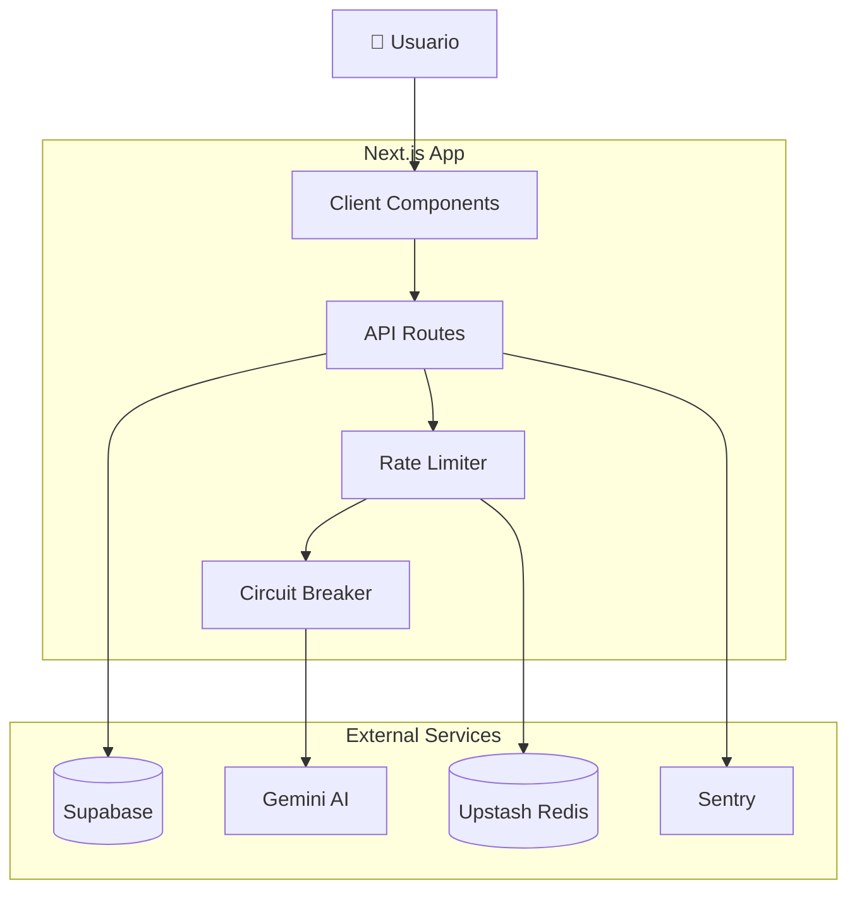

# Arquitectura Qalia Next.js - V3 (Production-Ready)

> **Versión mejorada** con correcciones críticas de seguridad, resiliencia y performance integradas.

## 📋 Índice

1. [Visión General](#visión-general)
2. [Stack Tecnológico](#stack-tecnológico)
3. [Arquitectura General](#arquitectura-general)
4. [Estructura del Proyecto](#estructura-del-proyecto)
5. [Database Schema](#database-schema)
6. [Autenticación y Seguridad](#autenticación-y-seguridad)
7. [Sistema de Resiliencia](#sistema-de-resiliencia)
8. [Sistema de Monetización](#sistema-de-monetización)
9. [Integración con Gemini AI](#integración-con-gemini-ai)
10. [Validación y Type Safety](#validación-y-type-safety)
11. [Monitoring y Observabilidad](#monitoring-y-observabilidad)
12. [Testing](#testing)
13. [Plan de Implementación](#plan-de-implementación)

---

## 🎯 Visión General

**Qalia** es una app de nutrición con IA que permite:
- 📸 Analizar comidas con foto (Gemini Vision)
- 💬 Chatear con coach nutricional (Kili)
- 📊 Trackear progreso con analytics visuales
- 💰 Modelo freemium/premium con Polar.sh

**Principios de Arquitectura:**
- ✅ Type-safe end-to-end (TypeScript strict)
- ✅ Server-first (API keys protegidas con runtime check)
- ✅ Resiliente (Circuit breakers, rate limiting)
- ✅ Observable (Sentry, Web Vitals, health checks)
- ✅ Escalable y mantenible

---

## 🛠 Stack Tecnológico

### Core Framework
```json
{
  "framework": "Next.js 16.1.6 (App Router)",
  "language": "TypeScript 5.x (strict mode)",
  "runtime": "React 19",
  "styling": "Tailwind CSS v4"
}
```

### Backend & Database
- **BaaS:** Supabase (Auth + Database + Storage)
- **Types:** Supabase CLI (tipos generados automáticamente)
- **AI:** Google Gemini 2.0 Flash (server-only)
- **Payments:** Polar.sh (Merchant of Record)
- **Rate Limiting:** Upstash Redis

### Estado & Datos
- **Server State:** React Query (con retry + error handling)
- **Client State:** Zustand (con límites de persistencia)
- **Forms:** React Hook Form + Zod validation

### Calidad de Código
```bash
# All-in-one linting & formatting
bun add -D @biomejs/biome

# Type-safe env validation
bun add @t3-oss/env-nextjs zod

# Git hooks
bun add -D husky @commitlint/{cli,config-conventional}

# Rate limiting
bun add @upstash/ratelimit @upstash/redis

# Error tracking
bun add @sentry/nextjs
```

---

## 🏗 Arquitectura General

### Diagrama con Resiliencia



---

## 📂 Estructura del Proyecto

```
qalia-nextjs-app/
├── src/
│   ├── app/
│   │   ├── api/
│   │   │   ├── gemini/
│   │   │   │   └── analyze-image/
│   │   │   ├── customer/
│   │   │   └── health/              # ← NUEVO: Health check
│   │   ├── checkout/
│   │   └── portal/
│   ├── components/
│   │   ├── ui/
│   │   ├── features/
│   │   └── shared/
│   │       └── ErrorBoundary.tsx    # ← NUEVO
│   ├── lib/
│   │   ├── supabase/
│   │   ├── gemini/
│   │   │   ├── client.ts            # ← Con runtime check
│   │   │   ├── circuit-breaker.ts   # ← NUEVO
│   │   │   └── rate-limiter.ts      # ← NUEVO
│   │   ├── polar/
│   │   ├── resilience/              # ← NUEVO
│   │   │   ├── circuit-breaker.ts
│   │   │   └── feature-flags.ts
│   │   └── monitoring/              # ← NUEVO
│   │       ├── budget-tracker.ts
│   │       └── web-vitals.ts
│   ├── services/
│   ├── hooks/
│   ├── stores/
│   │   └── uiStore.ts               # ← Con límites
│   └── types/
│       └── supabase.ts              # ← Generado automáticamente
├── supabase/
│   ├── migrations/
│   │   ├── 001_initial_schema.sql
│   │   ├── 002_performance_indices.sql
│   │   └── 003_analytics_triggers.sql
│   └── scripts/
│       ├── backup.sh
│       └── restore.sh
├── tests/
│   ├── unit/
│   ├── integration/
│   └── e2e/
├── AGENTS.md
├── CLAUDE.md
└── .env.example
```

---

## 🗄️ Database Schema

### Schema Mejorado (con soft delete e índices)

```prisma
// prisma/schema.prisma

model Profile {
  id        String   @id @default(uuid())
  userId    String   @unique
  email     String   @unique
  name      String
  
  // Personal info
  age       Int?
  gender    String?
  height    Float?
  weight    Float?
  
  // Goals
  goal           String?
  activityLevel  String?
  targetCalories Int?
  
  // Subscription cache
  subscriptionTier String @default("free")
  
  // Soft delete ← NUEVO
  deletedAt DateTime?
  
  // Timestamps
  createdAt DateTime @default(now())
  updatedAt DateTime @updatedAt
  
  meals         Meal[]
  chatHistory   ChatMessage[]
  weightHistory WeightEntry[]
  
  @@index([deletedAt])
  @@map("profiles")
}

model Meal {
  id        String   @id @default(cuid())
  userId    String
  
  name      String
  calories  Float
  protein   Float
  carbs     Float
  fat       Float
  
  imageUrl    String?
  ingredients String[]
  safetyStatus String? // danger, warning, safe ← NUEVO
  
  mealTime  DateTime
  createdAt DateTime @default(now())
  
  user Profile @relation(fields: [userId], references: [id], onDelete: Cascade)
  
  // Índices para queries comunes ← MEJORADO
  @@index([userId, createdAt(sort: Desc)])
  @@index([userId, mealTime])
  @@index([userId, safetyStatus])
  @@map("meals")
}

model DailyCalories {
  id             String   @id @default(cuid())
  userId         String
  date           DateTime @db.Date
  totalCalories  Float    @default(0)
  protein        Float    @default(0)
  carbs          Float    @default(0)
  fat            Float    @default(0)
  mealsCount     Int      @default(0)
  
  createdAt DateTime @default(now())
  updatedAt DateTime @updatedAt
  
  @@unique([userId, date])
  @@index([userId, date(sort: Desc)])
  @@map("daily_calories")
}
```

### Database Trigger para Analytics (NUEVO)

```sql
-- supabase/migrations/003_analytics_triggers.sql

CREATE OR REPLACE FUNCTION update_daily_calories_trigger()
RETURNS TRIGGER AS $$
BEGIN
  INSERT INTO daily_calories (user_id, date, total_calories, protein, carbs, fat, meals_count)
  VALUES (
    NEW.user_id,
    DATE(NEW.created_at),
    NEW.calories,
    NEW.protein,
    NEW.carbs,
    NEW.fat,
    1
  )
  ON CONFLICT (user_id, date) 
  DO UPDATE SET
    total_calories = daily_calories.total_calories + EXCLUDED.total_calories,
    protein = daily_calories.protein + EXCLUDED.protein,
    carbs = daily_calories.carbs + EXCLUDED.carbs,
    fat = daily_calories.fat + EXCLUDED.fat,
    meals_count = daily_calories.meals_count + 1,
    updated_at = NOW();
  
  RETURN NEW;
END;
$$ LANGUAGE plpgsql;

CREATE TRIGGER meals_to_daily_calories
  AFTER INSERT ON meals
  FOR EACH ROW
  EXECUTE FUNCTION update_daily_calories_trigger();
```

### Generar Tipos de Supabase (NUEVO)

```bash
# Genera tipos automáticamente - elimina `any`
npx supabase gen types typescript --project-id <project-id> > src/types/supabase.ts
```

---

## 🔐 Autenticación y Seguridad

### RLS Policies Completas (MEJORADO)

```sql
-- Supabase SQL Editor

-- Profiles
CREATE POLICY "Users can view own profile"
  ON profiles FOR SELECT
  USING (auth.uid() = user_id);

CREATE POLICY "Users can update own profile"
  ON profiles FOR UPDATE
  USING (auth.uid() = user_id);

-- Soft delete en lugar de hard delete
CREATE POLICY "Users cannot delete their profile"
  ON profiles FOR DELETE
  USING (false);

-- Meals con eager loading seguro
CREATE POLICY "Users can view own meals"
  ON meals FOR SELECT
  USING (auth.uid() = user_id);

CREATE POLICY "Users can insert own meals"
  ON meals FOR INSERT
  WITH CHECK (auth.uid() = user_id);

CREATE POLICY "Users can delete own meals"
  ON meals FOR DELETE
  USING (auth.uid() = user_id);

-- Storage policies (NUEVO)
CREATE POLICY "Users can upload their own photos"
  ON storage.objects FOR INSERT
  WITH CHECK (
    bucket_id = 'meal-images' AND 
    (storage.foldername(name))[1] = auth.uid()::text
  );

CREATE POLICY "Users can view their own photos"
  ON storage.objects FOR SELECT
  USING (
    bucket_id = 'meal-images' AND 
    (storage.foldername(name))[1] = auth.uid()::text
  );
```

---

## 🛡️ Sistema de Resiliencia (NUEVO)

### 1. Gemini Client con Runtime Check

```typescript
// lib/gemini/client.ts
import { GoogleGenerativeAI } from "@google/generative-ai";
import { env } from "@/env";

// ✅ CRÍTICO: Previene exposición de API key al cliente
if (typeof window !== "undefined") {
  throw new Error("Gemini client cannot be imported on client side");
}

if (!env.GEMINI_API_KEY) {
  throw new Error("GEMINI_API_KEY is not defined");
}

export const genAI = new GoogleGenerativeAI(env.GEMINI_API_KEY);
export const model = genAI.getGenerativeModel({ model: "gemini-2.0-flash" });
```

### 2. Circuit Breaker Pattern

```typescript
// lib/resilience/circuit-breaker.ts

type CircuitState = "CLOSED" | "OPEN" | "HALF_OPEN";

interface CircuitBreakerConfig {
  failureThreshold: number;
  successThreshold: number;
  timeout: number;
}

export class CircuitBreaker {
  private state: CircuitState = "CLOSED";
  private failures = 0;
  private successes = 0;
  private lastFailTime = 0;

  constructor(
    private name: string,
    private config: CircuitBreakerConfig = {
      failureThreshold: 5,
      successThreshold: 2,
      timeout: 60_000, // 1 min
    }
  ) {}

  async execute<T>(fn: () => Promise<T>): Promise<T> {
    if (this.state === "OPEN") {
      if (Date.now() - this.lastFailTime >= this.config.timeout) {
        this.state = "HALF_OPEN";
        this.successes = 0;
      } else {
        throw new Error(`Circuit breaker ${this.name} is OPEN`);
      }
    }

    try {
      const result = await fn();
      this.onSuccess();
      return result;
    } catch (error) {
      this.onFailure();
      throw error;
    }
  }

  private onSuccess() {
    if (this.state === "HALF_OPEN") {
      this.successes++;
      if (this.successes >= this.config.successThreshold) {
        this.reset();
      }
    } else {
      this.failures = 0;
    }
  }

  private onFailure() {
    this.failures++;
    this.lastFailTime = Date.now();

    if (this.state === "HALF_OPEN" || this.failures >= this.config.failureThreshold) {
      this.state = "OPEN";
      console.error(`🚨 Circuit breaker ${this.name} is OPEN`);
    }
  }

  private reset() {
    this.state = "CLOSED";
    this.failures = 0;
    this.successes = 0;
  }

  getState(): CircuitState {
    return this.state;
  }
}

// Instancias globales
export const geminiCircuitBreaker = new CircuitBreaker("gemini-api");
export const supabaseCircuitBreaker = new CircuitBreaker("supabase-api", {
  failureThreshold: 10,
  successThreshold: 3,
  timeout: 30_000,
});
```

### 3. Rate Limiting per User

```typescript
// lib/gemini/rate-limiter.ts
import { Ratelimit } from "@upstash/ratelimit";
import { Redis } from "@upstash/redis";

const redis = Redis.fromEnv();

export const geminiRatelimit = new Ratelimit({
  redis,
  limiter: Ratelimit.slidingWindow(10, "1 m"), // 10 req/min para free
  analytics: true,
});

// Diferentes límites por tier
export function getRateLimitForTier(tier: "free" | "premium" | "pro") {
  const limits = {
    free: Ratelimit.slidingWindow(10, "1 m"),
    premium: Ratelimit.slidingWindow(50, "1 m"),
    pro: Ratelimit.slidingWindow(200, "1 m"),
  };
  
  return new Ratelimit({
    redis,
    limiter: limits[tier],
    analytics: true,
  });
}
```

### 4. Feature Flags

```typescript
// lib/resilience/feature-flags.ts

export const FEATURES = {
  ANALYTICS_TRIGGERS: getFlag("ENABLE_ANALYTICS_TRIGGERS", true),
  GEMINI_RATE_LIMIT: getFlag("ENABLE_GEMINI_RATE_LIMIT", true),
  PWA_OFFLINE: getFlag("ENABLE_PWA_OFFLINE", false),
  COMMUNITY_FEATURES: getFlag("ENABLE_COMMUNITY_FEATURES", false),
} as const;

function getFlag(envVar: string, defaultValue: boolean): boolean {
  const value = process.env[envVar];
  if (value === undefined) return defaultValue;
  return value === "true";
}
```

---

## 💰 Sistema de Monetización (Polar.sh)

### Modelo de 3 Tiers

| Tier | Precio | Análisis/mes | Chat | Rate Limit |
|------|--------|--------------|------|------------|
| **Free** | $0 | 10 | ❌ | 10 req/min |
| **Premium** | $9.99 | 100 | ✅ | 50 req/min |
| **Pro** | $19.99 | ♾️ | ✅ | 200 req/min |

### Setup

```bash
bun add @polar-sh/sdk
```

Ver [polar-mejoras-chess-battle.md](file:///Users/milumon/.gemini/antigravity/brain/444fe28d-f21f-4d38-b806-4d0803e406f2/polar-mejoras-chess-battle.md) para implementación completa.

---

## 🤖 Integración con Gemini AI (MEJORADO)

### Servicio con Circuit Breaker y Rate Limiting

```typescript
// services/geminiService.ts
import { model } from "@/lib/gemini/client";
import { geminiCircuitBreaker } from "@/lib/resilience/circuit-breaker";
import { geminiRatelimit } from "@/lib/gemini/rate-limiter";

export const geminiService = {
  async analyzeFoodImage(imageBase64: string, userId: string) {
    // 1. Rate limit check
    const { success } = await geminiRatelimit.limit(userId);
    if (!success) {
      throw new Error("Too many requests");
    }

    // 2. Circuit breaker protection
    return geminiCircuitBreaker.execute(async () => {
      const result = await model.generateContent([
        `Analiza esta imagen de comida y retorna JSON con: name, calories, protein, carbs, fat, ingredients, suggestions`,
        { inlineData: { mimeType: "image/jpeg", data: imageBase64 } },
      ]);

      const text = result.response.text();
      const jsonMatch = text.match(/\{[\s\S]*\}/);
      if (!jsonMatch) throw new Error("Invalid response format");
      
      return JSON.parse(jsonMatch[0]);
    });
  },
};
```

### API Route Production-Ready

```typescript
// app/api/gemini/analyze-image/route.ts
import { NextRequest, NextResponse } from "next/server";
import { auth } from "@/lib/supabase/server";
import { checkMealAnalysisLimit, recordMealAnalysis } from "@/lib/polar/check-limits";
import { geminiService } from "@/services/geminiService";
import { z } from "zod";
import * as Sentry from "@sentry/nextjs";

const requestSchema = z.object({
  imageBase64: z.string().min(1),
});

export async function POST(req: NextRequest) {
  const { data: { user } } = await auth.getUser();

  if (!user) {
    return NextResponse.json({ error: "Unauthorized" }, { status: 401 });
  }

  try {
    // 1. Verificar límite de Polar
    const { allowed, balance } = await checkMealAnalysisLimit(user.id);
    if (!allowed) {
      return NextResponse.json(
        { error: "Monthly limit reached", balance, upgradeUrl: "/pricing" },
        { status: 429 }
      );
    }

    // 2. Validar request
    const body = await req.json();
    const validation = requestSchema.safeParse(body);
    if (!validation.success) {
      return NextResponse.json(
        { error: "Invalid request", details: validation.error.format() },
        { status: 400 }
      );
    }

    // 3. Analizar imagen (con circuit breaker + rate limit internos)
    const result = await geminiService.analyzeFoodImage(
      validation.data.imageBase64,
      user.id
    );

    // 4. Registrar uso
    await recordMealAnalysis(user.id);

    return NextResponse.json(result);
  } catch (error) {
    // 5. Error tracking
    Sentry.captureException(error, {
      user: { id: user.id },
      tags: { api: "gemini-analyze" },
    });

    if (error instanceof Error) {
      if (error.message === "Too many requests") {
        return NextResponse.json({ error: "Rate limit exceeded" }, { status: 429 });
      }
      if (error.message.includes("Circuit breaker")) {
        return NextResponse.json(
          { error: "Service temporarily unavailable" },
          { status: 503 }
        );
      }
    }

    return NextResponse.json({ error: "Internal server error" }, { status: 500 });
  }
}
```

---

## ✅ Validación y Type Safety

### Environment Variables Completas

```typescript
// env.ts
import { createEnv } from "@t3-oss/env-nextjs";
import { z } from "zod";

export const env = createEnv({
  server: {
    DATABASE_URL: z.string().url(),
    GEMINI_API_KEY: z.string().min(1),
    SUPABASE_SERVICE_ROLE_KEY: z.string().min(1),
    POLAR_ACCESS_TOKEN: z.string().min(1),
    UPSTASH_REDIS_REST_URL: z.string().url(),
    UPSTASH_REDIS_REST_TOKEN: z.string().min(1),
    SENTRY_DSN: z.string().url().optional(),
    GEMINI_DAILY_BUDGET_USD: z.coerce.number().default(10),
  },
  client: {
    NEXT_PUBLIC_SUPABASE_URL: z.string().url(),
    NEXT_PUBLIC_SUPABASE_ANON_KEY: z.string().min(1),
    NEXT_PUBLIC_SENTRY_DSN: z.string().url().optional(),
  },
  runtimeEnv: {
    DATABASE_URL: process.env.DATABASE_URL,
    GEMINI_API_KEY: process.env.GEMINI_API_KEY,
    SUPABASE_SERVICE_ROLE_KEY: process.env.SUPABASE_SERVICE_ROLE_KEY,
    POLAR_ACCESS_TOKEN: process.env.POLAR_ACCESS_TOKEN,
    UPSTASH_REDIS_REST_URL: process.env.UPSTASH_REDIS_REST_URL,
    UPSTASH_REDIS_REST_TOKEN: process.env.UPSTASH_REDIS_REST_TOKEN,
    SENTRY_DSN: process.env.SENTRY_DSN,
    GEMINI_DAILY_BUDGET_USD: process.env.GEMINI_DAILY_BUDGET_USD,
    NEXT_PUBLIC_SUPABASE_URL: process.env.NEXT_PUBLIC_SUPABASE_URL,
    NEXT_PUBLIC_SUPABASE_ANON_KEY: process.env.NEXT_PUBLIC_SUPABASE_ANON_KEY,
    NEXT_PUBLIC_SENTRY_DSN: process.env.NEXT_PUBLIC_SENTRY_DSN,
  },
});
```

### React Query Config Profesional (MEJORADO)

```typescript
// app/providers.tsx
"use client";

import { QueryClient, QueryClientProvider } from "@tanstack/react-query";
import { useState } from "react";
import { ErrorBoundary } from "@/components/shared/ErrorBoundary";

export function Providers({ children }: { children: React.ReactNode }) {
  const [queryClient] = useState(
    () =>
      new QueryClient({
        defaultOptions: {
          queries: {
            staleTime: 60 * 1000,
            retry: 3,
            retryDelay: (attemptIndex) => Math.min(1000 * 2 ** attemptIndex, 30000),
            refetchOnWindowFocus: true,
            refetchOnReconnect: true,
          },
          mutations: {
            retry: 1,
          },
        },
      })
  );

  return (
    <QueryClientProvider client={queryClient}>
      <ErrorBoundary>{children}</ErrorBoundary>
    </QueryClientProvider>
  );
}
```

### Zustand con Límites (MEJORADO)

```typescript
// stores/uiStore.ts
import { create } from "zustand";
import { persist, createJSONStorage } from "zustand/middleware";

interface UIState {
  theme: "light" | "dark";
  setTheme: (theme: "light" | "dark") => void;
}

export const useUIStore = create<UIState>()(
  persist(
    (set) => ({
      theme: "light",
      setTheme: (theme) => set({ theme }),
    }),
    {
      name: "ui-storage",
      version: 1,
      // ✅ Solo persistir datos pequeños
      partialize: (state) => ({ theme: state.theme }),
      storage: createJSONStorage(() => {
        return {
          ...localStorage,
          setItem: (name, value) => {
            // ✅ Límite de 100KB
            if (value.length > 100_000) {
              console.warn("Storage size exceeded, skipping");
              return;
            }
            localStorage.setItem(name, value);
          },
          getItem: (name) => localStorage.getItem(name),
          removeItem: (name) => localStorage.removeItem(name),
        };
      }),
    }
  )
);
```

---

## 📊 Monitoring y Observabilidad (NUEVO)

### Health Check Endpoint

```typescript
// app/api/health/route.ts
import { NextResponse } from "next/server";
import { geminiCircuitBreaker, supabaseCircuitBreaker } from "@/lib/resilience/circuit-breaker";
import { supabase } from "@/lib/supabase/server";

export const dynamic = "force-dynamic";

export async function GET() {
  const checks = {
    gemini: { state: geminiCircuitBreaker.getState() },
    supabase: { state: supabaseCircuitBreaker.getState() },
    database: await checkDatabase(),
  };

  const isHealthy =
    checks.gemini.state !== "OPEN" &&
    checks.supabase.state !== "OPEN" &&
    checks.database.healthy;

  return NextResponse.json(
    {
      status: isHealthy ? "healthy" : "degraded",
      timestamp: new Date().toISOString(),
      checks,
    },
    { status: isHealthy ? 200 : 503 }
  );
}

async function checkDatabase() {
  try {
    const { error } = await supabase.from("profiles").select("id").limit(1);
    return { healthy: !error, error: error?.message };
  } catch (e) {
    return { healthy: false, error: String(e) };
  }
}
```

### Error Boundary con Sentry

```typescript
// components/shared/ErrorBoundary.tsx
"use client";

import { Component, ReactNode } from "react";
import * as Sentry from "@sentry/nextjs";

interface Props {
  children: ReactNode;
  fallback?: ReactNode;
}

interface State {
  hasError: boolean;
}

export class ErrorBoundary extends Component<Props, State> {
  constructor(props: Props) {
    super(props);
    this.state = { hasError: false };
  }

  static getDerivedStateFromError() {
    return { hasError: true };
  }

  componentDidCatch(error: Error, errorInfo: React.ErrorInfo) {
    Sentry.withScope((scope) => {
      scope.setContext("react", errorInfo);
      Sentry.captureException(error);
    });
  }

  render() {
    if (this.state.hasError) {
      return (
        this.props.fallback || (
          <div className="p-4 text-center">
            <h2 className="text-xl font-bold">Algo salió mal</h2>
            <button
              onClick={() => this.setState({ hasError: false })}
              className="mt-4 px-4 py-2 bg-primary text-white rounded"
            >
              Intentar de nuevo
            </button>
          </div>
        )
      );
    }

    return this.props.children;
  }
}
```

### Web Vitals Tracking

```typescript
// lib/monitoring/web-vitals.ts
import { onCLS, onFID, onFCP, onLCP, onTTFB, Metric } from "web-vitals";

function sendToAnalytics(metric: Metric) {
  // Vercel Analytics
  if (typeof window !== "undefined" && (window as any).va) {
    (window as any).va("event", metric.name, {
      value: Math.round(metric.name === "CLS" ? metric.value * 1000 : metric.value),
    });
  }

  if (process.env.NODE_ENV === "development") {
    console.log(`[Web Vital] ${metric.name}:`, metric.value);
  }
}

export function reportWebVitals() {
  if (typeof window === "undefined") return;
  onCLS(sendToAnalytics);
  onFID(sendToAnalytics);
  onFCP(sendToAnalytics);
  onLCP(sendToAnalytics);
  onTTFB(sendToAnalytics);
}
```

---

## 🧪 Testing (NUEVO)

### Integration Test Example

```typescript
// tests/integration/analyze-image.test.ts
import { describe, it, expect, vi, beforeEach } from "vitest";
import { POST } from "@/app/api/gemini/analyze-image/route";
import { NextRequest } from "next/server";

vi.mock("@/lib/gemini/client");
vi.mock("@/lib/supabase/server", () => ({
  auth: {
    getUser: vi.fn().mockResolvedValue({
      data: { user: { id: "user-123", email: "test@example.com" } },
    }),
  },
}));

describe("POST /api/gemini/analyze-image", () => {
  it("returns 401 for unauthenticated requests", async () => {
    vi.mocked(auth.getUser).mockResolvedValueOnce({ data: { user: null } });

    const req = new NextRequest("http://localhost:3000/api/gemini/analyze-image", {
      method: "POST",
      body: JSON.stringify({ imageBase64: "abc123" }),
    });

    const response = await POST(req);
    expect(response.status).toBe(401);
  });

  it("returns 429 when rate limited", async () => {
    // Mock rate limit exceeded
    vi.mocked(geminiRatelimit.limit).mockResolvedValueOnce({ success: false });

    const req = new NextRequest("http://localhost:3000/api/gemini/analyze-image", {
      method: "POST",
      body: JSON.stringify({ imageBase64: "abc123" }),
    });

    const response = await POST(req);
    expect(response.status).toBe(429);
  });
});
```

---

## 📅 Plan de Implementación

### Fases con Entrega de Valor

| Fase | Duración | Entregas |
|------|----------|----------|
| **0: Foundation** | 1 semana | Staging env, circuit breaker, feature flags, health checks |
| **1: MVP Core** | 3 semanas | Auth, análisis de comidas, chat, historial |
| **2: Analytics** | 2 semanas | Dashboard, gráficos, triggers |
| **3: Monetización** | 2 semanas | Polar.sh, rate limiting por tier |
| **4: Observabilidad** | 1 semana | Sentry, Web Vitals, budget alerts |
| **5: Testing** | 1 semana | Unit, integration, E2E tests |

**Total MVP monetizable:** 8-10 semanas

Ver [implementation-roadmap.md](file:///Users/milumon/.gemini/antigravity/brain/444fe28d-f21f-4d38-b806-4d0803e406f2/implementation-roadmap.md) para el plan detallado.

---

## 📋 Checklist Pre-Production

### Seguridad
- [ ] Runtime check en Gemini client
- [ ] RLS policies completas (incluyendo Storage)
- [ ] Rate limiting con Upstash Redis
- [ ] Feature flags para rollback

### Resiliencia
- [ ] Circuit breaker para Gemini
- [ ] Circuit breaker para Supabase
- [ ] Health check endpoint
- [ ] Budget tracker para Gemini API

### Monitoring
- [ ] Sentry configurado
- [ ] Web Vitals tracking
- [ ] Error boundaries en UI
- [ ] Logs estructurados

### Database
- [ ] Índices para queries comunes
- [ ] Triggers para analytics
- [ ] Soft delete implementado
- [ ] Backup strategy

### Testing
- [ ] Unit tests para services
- [ ] Integration tests para API routes
- [ ] Mock de Gemini y Supabase

---

## 📚 Referencias

- [Pawboard Best Practices](file:///Users/milumon/.gemini/antigravity/brain/444fe28d-f21f-4d38-b806-4d0803e406f2/pawboard-best-practices.md)
- [Polar.sh Integration](file:///Users/milumon/.gemini/antigravity/brain/444fe28d-f21f-4d38-b806-4d0803e406f2/polar-mejoras-chess-battle.md)
- [Implementation Roadmap](file:///Users/milumon/.gemini/antigravity/brain/444fe28d-f21f-4d38-b806-4d0803e406f2/implementation-roadmap.md)

---

**Rating esperado: 9.5/10** 🚀
